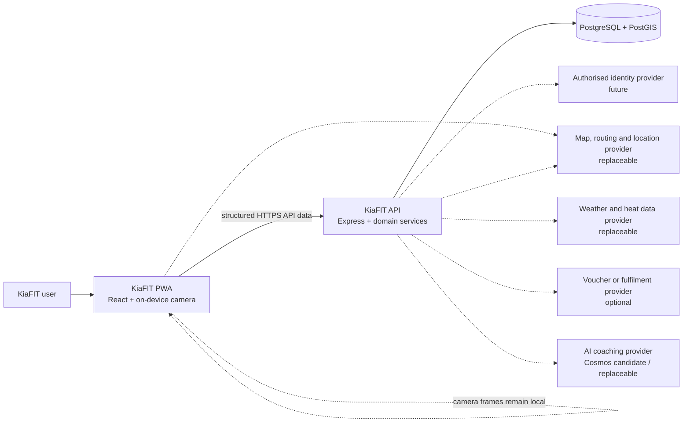
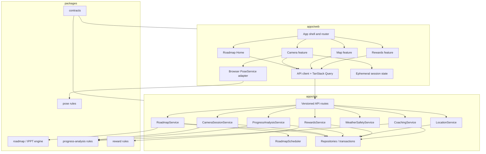
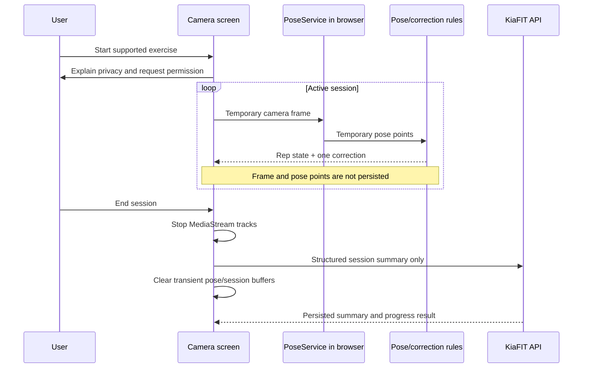

# KiaFIT High-Level Design

**Status:** Target architecture aligned with the current repository  
**Last updated:** 30 August 2026  
**Related documents:** [Product requirements](PRODUCT_REQUIREMENTS.md) · [Low-level design](LOW_LEVEL_DESIGN.md) · [Posture tracking and AI coaching](POSTURE_TRACKING_AI_COACHING_ARCHITECTURE.md)

## 1. Purpose

This document describes the target system architecture for KiaFIT. It preserves the existing React, Vite, TypeScript, Express and pnpm-workspace foundation while defining how the Roadmap, Camera, Map, Rewards and supporting services should fit together.

The architecture follows four rules:

1. Keep UI, business rules and data access separate.
2. Process camera frames and pose points on the device whenever possible.
3. Hide external providers behind replaceable service interfaces.
4. Never describe planned or simulated behavior as a connected production capability.

## 2. Current repository and reuse assessment

The current repository is a clean early-stage scaffold, not a completed application.

| Area | What exists now | Reuse decision | Target gap |
| --- | --- | --- | --- |
| Workspace | pnpm monorepo with `apps/*` and `packages/*` | Keep | Add target feature modules and tests incrementally. |
| Web | React 19, Vite, TypeScript, PWA plugin, React Router, TanStack Query | Keep | Replace placeholder navigation with Home, Camera, Map and Rewards; add feature flows and states. |
| Styling | Mobile-first custom CSS, green palette, calm backgrounds, card system and bottom navigation | Reuse and evolve | Formalise reusable tokens and accessible component states. |
| API | Express 5 with CORS, Helmet, rate limiting, logging, environment validation and `/api/health` | Keep | Add versioned domain routes, authentication, persistence and services. |
| Contracts | Zod schemas for basic exercise, workout, KIAStop and health data | Extend | Add roadmaps, sessions, corrections, locations, check-ins, rewards and API errors. |
| IPPT package | Basic targets and percentage calculation; ruleset explicitly unverified | Keep the package boundary | Generalise to goal roadmaps, scheduling and versioned verified scoring data. |
| Pose rules | Confidence check, joint-angle calculation and rep-counter state | Keep | Add exercise-specific state machines, correction rules, aggregation and tests. |
| Pose model | Local Teachable Machine classifier for push-ups, sit-ups, planking and squats | Wrap behind `PoseService` | It identifies exercise classes; it does not independently validate reps, form, pull-ups or gym machines. |
| Map | Leaflet dependencies and a visual placeholder | Reuse dependency choice | Add map provider adapter, PostGIS-backed locations, permission and route states. |
| Database | PostgreSQL driver and migration tool declared; no migrations yet | Keep | Design and migrate PostgreSQL/PostGIS schema. |
| Tests | No tests currently present | Add | Prioritise deterministic business rules and privacy cleanup behavior. |

No `AGENTS.md` instructions are present in the repository.

## 3. Target navigation and route migration

The target primary navigation is:

| Destination | Purpose | Target route |
| --- | --- | --- |
| Home | Roadmap, active goal, today’s plan and progress | `/` |
| Camera | Exercise selection and live guidance | `/camera` |
| Map | KIAStops, KIAGyms, routes and check-ins | `/map` |
| Rewards | Balance, vouchers, redemptions and point history | `/rewards` |

The current routes are placeholders and should be migrated without losing inbound links:

| Current route | Target treatment |
| --- | --- |
| `/` | Evolve into Roadmap Home. |
| `/ippt` | Move IPPT goal content into Home; retain a temporary redirect or goal-detail route if links exist. |
| `/coach` | Redirect to `/camera`. |
| `/participate` | Redirect to `/map`. |

The Roadmap is not a fifth navigation destination, and there is no separate Daily page.

## 4. System context



Dashed external connections indicate replaceable integrations that may be simulated during development. The system must expose provider status so the UI can state whether data is live, cached, unavailable or simulated.

## 5. Container architecture

### 5.1 React PWA

The PWA owns:

- Primary navigation and feature screens.
- Roadmap presentation and task launch context.
- Camera permission, stream lifecycle and in-memory pose processing.
- Map presentation, browser location permission and route interaction.
- Server-state caching through TanStack Query.
- Accessible loading, empty, permission and error states.
- Offline shell and carefully scoped cached data.

The PWA does not own authoritative reward balances, completed-task history, schedule adjustments or check-in verification. Those are API responsibilities.

### 5.2 Express API

The API owns:

- Authentication and user authorisation once an identity method is selected.
- Active goal, roadmap, stages, tasks and schedule adjustments.
- Camera-session summary validation and persistence.
- Technique-progress comparison and aggregation.
- KIAStop/KIAGym records and geospatial queries.
- Check-in validation and idempotency.
- Weather-safety evaluation or provider mediation.
- KiAPoints rules, ledger, balance and reward redemption.
- Asynchronous, provider-neutral AI coaching over approved structured movement summaries when enabled.
- Audit records, structured errors and provider status.

### 5.3 PostgreSQL and PostGIS

PostgreSQL is the source of truth for user-owned and transactional state. PostGIS provides location storage and proximity queries. The database stores structured summaries and location events, not camera frames, video or raw pose timelines.

### 5.4 External providers

External capabilities are accessed through adapters:

- **Identity provider:** student or citizen identity verification when authorised.
- **Map/location provider:** map tiles, geocoding and routing as selected.
- **Weather provider:** current conditions and safety inputs.
- **Reward provider:** voucher inventory or fulfilment only for confirmed relationships.
- **AI coaching provider:** optional higher-level reasoning over approved derived metrics; never the real-time pose tracker or authoritative rep counter.

Development adapters return realistic mock data with an explicit `simulated` source marker.

## 6. Logical architecture



The `packages` layer contains deterministic, environment-independent rules. Browser APIs, Express request objects, SQL and provider SDKs must not leak into those packages.

## 7. Target service boundaries

| Service | Primary responsibility | Must not do |
| --- | --- | --- |
| `RoadmapService` | Create/read/update goals, roadmaps, stages and task completion. | Contain UI state or directly calculate weather. |
| `RoadmapScheduler` | Apply missed-task and plan-recalculation rules deterministically. | Write directly to the database or send notifications. |
| `PoseService` | Convert an application-supplied temporary camera frame into provider-neutral landmarks/model outputs. | Open/control the camera, persist frames or upload frames. |
| `CameraSessionService` | Validate and store a structured session summary; link it to a task. | Receive video or full pose timelines. |
| `ProgressAnalysisService` | Select comparable sessions and calculate technique trends. | Claim medical safety or compare users. |
| `LocationService` | Find locations, estimate proximity, request routes through an adapter and validate arrival inputs. | Imply partnership from location category. |
| `WeatherSafetyService` | Turn time/weather inputs into neutral route warnings. | Treat provider failure as safe conditions. |
| `RewardsService` | Apply configurable eligibility rules, maintain an immutable ledger and redeem rewards. | Let clients set balances or award arbitrary points. |
| `CoachingService` | Asynchronously turn approved deterministic movement/session summaries into evidence-linked higher-level coaching through a replaceable provider. | Open the camera, receive continuous frames, count authoritative reps, block live feedback or make medical/safety claims. |

Repositories provide persistence behind the services. Provider adapters translate third-party responses into KiaFIT-owned contracts.

## 8. Principal data flows

### 8.1 Roadmap task completion

```text
Home loads active roadmap
  → user launches a task
  → task context travels to Camera or Map
  → feature completes an activity
  → API validates the activity and task relationship
  → task is completed transactionally
  → eligible KiAPoints ledger entry is created once
  → roadmap, progress and rewards queries are invalidated
```

### 8.2 Missed task and adaptive schedule

```text
Task reaches missed state or user marks it missed
  → optional reason is captured
  → RoadmapScheduler receives current schedule and constraints
  → completed work remains unchanged
  → recovery days and demanding-task spacing are preserved
  → minimal changes are proposed
  → changes and explanation are persisted atomically
  → Home displays the updated plan and explanation
```

### 8.3 Camera privacy flow



### 8.4 Verified location check-in

```text
User starts a task-linked route
  → Map displays route and safety status
  → user requests arrival/check-in
  → fresh location sample and accuracy are obtained
  → API checks proximity, task eligibility and duplicate-event key
  → check-in and optional task completion are saved
  → RewardsService creates one eligible ledger entry
  → Map, Home and Rewards update
```

## 9. Data ownership and retention boundaries

| Data | Owner/source of truth | Retention direction |
| --- | --- | --- |
| Active camera frame | Browser memory only | Release immediately after processing. |
| Raw pose points | Browser memory only | Discard after deriving rep/correction state; no default timeline retention. |
| Camera session summary | API/database | Retain according to account and analytics policy. |
| AI coaching input | Server-generated minimal structured aggregates | Send only when enabled and eligible; no frames, recordings or full raw pose timeline. |
| Validated AI coaching insight | API/database | Retain with evidence/provider/model/prompt/guardrail versions under the account retention policy. |
| Goal, roadmap and task state | API/database | Retain while roadmap/account is active; preserve audit history. |
| Schedule adjustments | API/database | Retain for explainability and audit. |
| Current browser location | Browser memory; API receives check-in sample when requested | Do not persist continuous location by default. |
| Verified check-in | API/database | Retain minimum data needed for audit and rewards. |
| Weather response | Provider/cache | Short-lived cache; retain evaluated warning if linked to an activity decision. |
| KiAPoints transaction | API/database | Immutable ledger record. |
| Voucher redemption | API/database/provider | Retain for fulfilment and dispute history. |

Retention periods require a separate data-governance decision before production.

## 10. Security and privacy architecture

### 10.1 Identity

The current project has no authentication implementation. A future authorised identity provider must sit behind an authentication adapter. An admin number is an identifier, not a credential. Development identities must be marked as test data.

### 10.2 API security

- Validate all requests and responses with shared schemas.
- Authorise every user-owned resource by authenticated user ID.
- Use HTTPS in production and secure, HTTP-only session handling or a reviewed token design.
- Rate-limit authentication, session submission, check-in and redemption endpoints separately.
- Use idempotency keys for activity completion, check-ins, point awards and redemption requests.
- Keep point rules and balances server-authoritative.
- Log event IDs and outcomes without raw camera or unnecessary location content.

### 10.3 Camera privacy

- Camera permission is user initiated.
- Camera streams are scoped to the Camera feature.
- Every `MediaStreamTrack` is stopped on completion, cancellation, navigation, unmount and fatal error.
- Frames and raw poses never enter API contracts.
- Service workers must not cache camera data or authenticated API responses indiscriminately.
- AI coaching is asynchronous and receives approved structured aggregates only. The baseline architecture does not upload frames or clips to an AI provider.

### 10.4 Location privacy

- Request location permission only when Map or a location task requires it.
- Prefer current-position samples over continuous tracking for check-in.
- If route tracking is introduced, make retention and consent explicit and separate from check-in.
- Avoid exposing exact user locations in analytics or logs.

## 11. Reliability and degraded behavior

| Dependency failure | Required behavior |
| --- | --- |
| API unavailable | Keep the application shell usable, show a clear offline state and avoid pretending changes were saved. |
| Pose model unavailable | Disable live analysis, explain the issue and never generate simulated results unless development mode is visibly active. |
| Low pose confidence | Pause or qualify counting and show positioning guidance; exclude the session from progress comparison when required. |
| AI coaching unavailable, slow or rejected | Continue pose tracking, reps, deterministic corrections, session completion and progress; show a typed optional-insight state. |
| Location denied | Show permission guidance and non-location browsing when possible; disable verified check-in. |
| Route unavailable | Keep the location visible and offer retry or another location. |
| Weather unavailable | Show safety data unavailable; do not display a false all-clear. |
| Reward provider unavailable | Preserve an internally accepted redemption as pending only when safe and idempotent; otherwise reject clearly without deducting twice. |
| Database transaction failure | Roll back coupled changes such as task completion plus points. |

## 12. Observability

Use structured event logging for:

- Roadmap task completed, missed and rescheduled.
- Schedule adjustment created and reason category.
- Camera session accepted or rejected, without frame/pose payloads.
- Technique comparison produced or excluded and its reason code.
- AI coaching job requested/completed/rejected, including provider and version metadata but not raw movement payloads in normal logs.
- Location check-in accepted or rejected.
- Safety warning category produced and provider status.
- Point transaction and reward redemption outcomes.

Logs should include correlation IDs and opaque resource IDs, not student admin numbers, raw pose data, precise continuous routes or voucher secrets.

Product analytics should measure completion funnels, return participation, schedule recoverability and permission outcomes—not body comparisons.

## 13. Deployment direction

The target deployment has three independently configurable parts:

1. Static/PWA hosting for `apps/web` over HTTPS.
2. Node/Express hosting for `apps/api` over HTTPS.
3. Managed PostgreSQL with PostGIS, backups and migration control.

Provider credentials live in server-side secret storage. The browser receives only public configuration appropriate for its selected map provider. Development and production environments use different databases, provider credentials and mock-service flags.

The first delivery remains a PWA. Capacitor may wrap the validated web application when native packaging is required. An Expo client would be a separate React Native presentation layer that reuses contracts and business rules, not a direct wrapper of React DOM screens.

## 14. Incremental architecture path

1. Update navigation and make Roadmap Home the canonical entry point.
2. Extend shared contracts and create deterministic roadmap/scheduler tests.
3. Add persistence, repositories and Roadmap API routes.
4. Introduce a provider-neutral `PoseTracker`, compare the existing adapter with a MediaPipe candidate, and implement privacy-safe camera lifecycle plus one validated exercise state machine.
5. Add session-summary persistence and comparable technique analysis.
6. Add KIAStop/KIAGym persistence, PostGIS search and location-provider adapters.
7. Add weather-safety evaluation and verified check-in flow.
8. Add server-authoritative KiAPoints ledger and Rewards experience.
9. Add optional provider-neutral AI coaching over structured summaries only after deterministic tracking and progress work reliably.
10. Connect authorised identity, production providers and confirmed reward partners.

Each stage should remain demonstrable with clearly labelled development adapters until its production integration is available.

## 15. Architecture decisions requiring confirmation

- Authentication and authorised student-verification provider.
- Whether roadmap scheduling executes synchronously in API transactions or through a background job for larger recalculations.
- Production map, route and weather providers.
- Check-in distance, accuracy and freshness requirements.
- Exercise-specific model/rule version compatibility policy.
- Pose provider selected through measured target-device validation rather than direct provider coupling.
- AI coaching opt-in, Cosmos or alternative provider deployment, data handling, output guardrails, asynchronous job infrastructure and cost policy.
- Data-retention and account-deletion policy.
- Notification delivery and whether it is required in the MVP.
- Reward catalogue owner, fulfilment model and anti-abuse thresholds.
