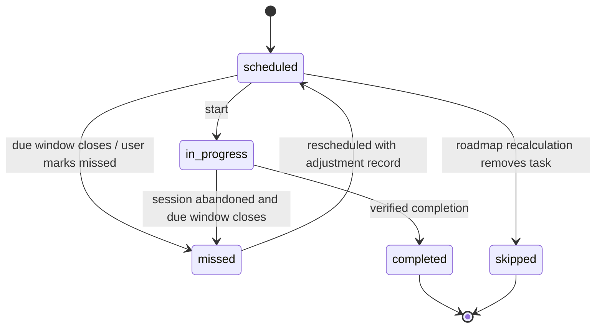
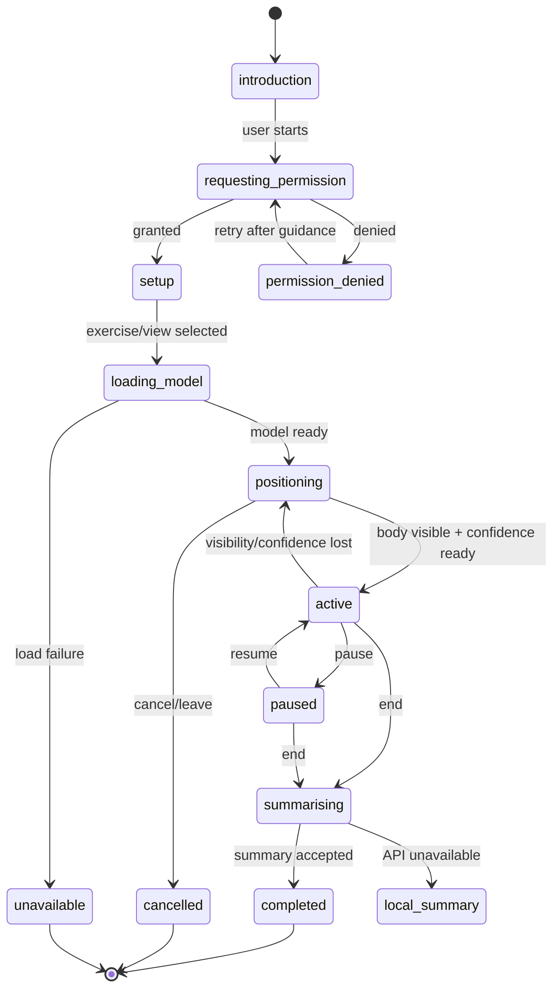

# KiaFIT Low-Level Design

**Status:** Target implementation design; no feature implementation is implied  
**Last updated:** 30 August 2026  
**Related documents:** [Product requirements](PRODUCT_REQUIREMENTS.md) · [High-level design](HIGH_LEVEL_DESIGN.md) · [Posture tracking and AI coaching](POSTURE_TRACKING_AI_COACHING_ARCHITECTURE.md)

## 1. Scope and conventions

This document turns the KiaFIT product requirements into implementable module, state, data and API designs. It is aligned with the existing TypeScript monorepo and intentionally separates current code from target behavior.

Conventions:

- IDs are UUIDs generated server-side unless an external provider owns the identifier.
- Persisted timestamps are UTC ISO 8601 values.
- A roadmap’s scheduled day is stored as a local calendar date plus an IANA time zone, not inferred from UTC alone.
- Distances are metres, durations are seconds and geographic coordinates use PostGIS geography/point types.
- Mutating API operations use an idempotency key when retries could duplicate completion, check-in, points or redemption.
- Version fields are required for goal rules, schedule algorithms, pose models, correction rules and reward rules.
- Provider-backed results identify their source as `live`, `cached`, `simulated` or `unavailable`.
- API contracts reject camera frames, video and raw pose timelines.

## 2. Target workspace modules

The following is a target organisation, not a requirement to create every file at once.

```text
apps/
├─ web/
│  └─ src/
│     ├─ app/                       router, providers, error boundaries
│     ├─ components/                shared accessible UI primitives
│     ├─ features/
│     │  ├─ roadmap/                Home, stages, today’s plan, goal summary
│     │  ├─ camera/                 permission, positioning, active session, summary
│     │  ├─ map/                    locations, filters, routes, check-in, safety
│     │  ├─ rewards/                balance, catalogue, ledger, redemption
│     │  └─ progress/               technique trends and session history
│     ├─ services/                  browser/provider adapters and API client
│     └─ styles/                    tokens, layout and component states
└─ api/
   └─ src/
      ├─ routes/v1/                 thin HTTP handlers
      ├─ services/                  application orchestration
      ├─ repositories/              SQL and transaction boundaries
      ├─ providers/                 identity, routing, weather, reward, AI adapters
      ├─ middleware/                auth, validation, idempotency, errors
      └─ config/                    validated environment and rule configuration

packages/
├─ contracts/                       Zod request, response and domain contracts
├─ ippt-engine/                     current goal/IPPT boundary; evolve generically
├─ pose-rules/                      pure exercise state machines and corrections
├─ roadmap-rules/                   target scheduler and roadmap calculations
├─ progress-rules/                  target comparability and trend calculations
└─ reward-rules/                    target point eligibility and calculation
```

The existing `@kiafit/ippt-engine` may initially host generic roadmap target types to avoid a disruptive rename. Once multiple goal types are implemented, generic logic should move to `@kiafit/roadmap-rules`, with compatibility exports during migration.

## 3. Client routes and launch context

### 3.1 Primary routes

| Route | Screen | Accepted context |
| --- | --- | --- |
| `/` | Roadmap Home | Optional adjustment or completion message. |
| `/camera` | Exercise selection or resumed setup | `taskId`, `exerciseId`; task data is revalidated through the API. |
| `/camera/session/:localSessionId` | Active transient camera session | Session state exists only in memory; direct reload returns to safe setup. |
| `/camera/summary/:sessionId` | Persisted structured summary | Server-owned session ID. |
| `/map` | Locations and routes | `taskId`, optional `locationId`, filters. |
| `/map/location/:locationId` | Location details | Actual location and partnership data from API. |
| `/rewards` | Balance and reward catalogue | Optional transaction or redemption result. |
| `/rewards/history` | Points and redemption history | Server-paginated history. |

Supporting goal selection, preferences and privacy information may be modal flows or secondary routes, but they do not become primary navigation items.

### 3.2 Existing-route compatibility

| Existing route | Migration behavior |
| --- | --- |
| `/coach` | Replace with `/camera`; keep a redirect while old links may exist. |
| `/participate` | Replace with `/map`; preserve task/location query context. |
| `/ippt` | Fold summary into Roadmap Home; redirect to `/` or a secondary goal-detail view. |

### 3.3 Task launch contract

Navigation may carry a `taskId` and convenience fields, but the destination must fetch the authoritative task before beginning. It must verify:

- The task belongs to the signed-in user.
- The task is launchable in its current status.
- The destination matches the task type.
- The requested exercise or location agrees with the task.
- A previously completed task is not awarded twice.

## 4. UI composition

### 4.1 App shell

The app shell contains:

- Product header and context-sensitive secondary action.
- Main content landmark.
- Four-item bottom navigation: Home, Camera, Map, Rewards.
- Route-level error boundary.
- API/offline status presentation that does not obscure primary content.
- Accessible focus restoration after route changes.

Navigation items always include text; icons alone are insufficient. All interactions work without hover.

### 4.2 Roadmap Home composition

Recommended content order:

1. `GoalSummary` — goal, stage, progress, period, consistency and next check.
2. `RoadmapStagePath` — Completed, Current and Upcoming stages.
3. `TodaysPlan` — actionable task cards with direct destinations.
4. `ScheduleAdjustmentNotice` — latest relevant change and reason.
5. `ProgressSnapshot` — technique or consistency trend when data passes quality gates.

The current roadmap must remain visible above secondary progress analytics on common mobile viewports.

### 4.3 Camera composition

The Camera feature uses distinct screens/states rather than one overloaded component:

- `CameraIntroduction` — supported capability and privacy explanation.
- `CameraPermission` — user-initiated permission request and denial recovery.
- `ExerciseSetup` — exercise, viewpoint and full-body positioning guidance.
- `PoseReadiness` — model loading, visibility and confidence.
- `ActiveCameraSession` — video preview, rep metrics, one correction, pause/end actions.
- `CameraSessionSummary` — structured counts, corrections and roadmap outcome.

### 4.4 Map composition

- `LocationPermissionState`.
- `LocationFilters` for KIAStop and KIAGym.
- `LocationMap` and accessible list alternative.
- `LocationCard` showing category and real name.
- `RoutePreview`.
- `RouteSafetyBanner`.
- `CheckInAction` with verification progress and result.

The map must never be the only way to select a location; a text list is required for accessibility and degraded map-provider states.

### 4.5 Rewards composition

- `PointsBalance`.
- `ConsistencyRewardExplanation`.
- `RewardCatalogue`.
- `RewardDetails`.
- `RedemptionConfirmation`.
- `PointTransactionList`.
- `RedemptionHistory`.

The balance displayed after mutation comes from the authoritative API response or a refetch, not client-side arithmetic alone.

## 5. Client state ownership

| State category | Owner | Examples |
| --- | --- | --- |
| Server state | TanStack Query | Roadmap, tasks, session summaries, locations, balance, reward catalogue. |
| Route state | React Router | Selected primary screen, `taskId`, `locationId`, persisted summary ID. |
| Form state | React Hook Form/local state | Goal selection, missed reason, redemption confirmation. |
| Short-lived UI state | Component reducer/state | Open card, filter panel, current correction announcement. |
| Camera session state | Dedicated in-memory reducer/service | Media stream, pose points, current rep phase, counters and correction aggregation. |
| Provider status | Query/service result | `live`, `cached`, `simulated`, `unavailable`. |

Camera frames, `MediaStream`, animation-frame handles and raw pose points must never enter TanStack Query, URL state, local storage, IndexedDB, analytics or service-worker caches.

## 6. Domain states and enums

### 6.1 Roadmap and task states

| Type | Values |
| --- | --- |
| Goal status | `active`, `completed`, `paused`, `replaced` |
| Roadmap status | `draft`, `active`, `completed`, `paused`, `superseded` |
| Stage state | `completed`, `current`, `upcoming` |
| Task status | `scheduled`, `in_progress`, `completed`, `missed`, `skipped` |
| Task type | `camera_exercise`, `run_to_location`, `gym_routine`, `recovery`, `progress_check` |
| Task intensity | `recovery`, `light`, `moderate`, `demanding` |
| Miss reason | `busy`, `not_feeling_well`, `schedule_changed`, `weather`, `other`, `not_provided` |

Rescheduling is an audited action rather than a permanent task status. A missed task may be returned to `scheduled` with a new date while its previous missed event and adjustment remain recorded.



Completed tasks are immutable to routine schedule recalculation. Administrative correction, if ever permitted, requires a separate audited operation.

### 6.2 Exercise metric types

Not every activity is repetition-based.

| Metric type | Examples | Primary result |
| --- | --- | --- |
| `repetitions` | Push-ups, sit-ups, squats, pull-ups | Total and correct repetitions. |
| `timed_hold` | Plank, some yoga poses | Hold duration and acceptable-form duration. |
| `distance_time` | 2.4 km or 5 km run | Distance, elapsed time and pace. |
| `duration_completion` | Recovery or mobility activity | Duration and completion. |
| `check_in` | Run to KIAStop/KIAGym | Verified arrival. |

The existing workout schema assumes repetitions. It must be generalised before planking, running and recovery outcomes are persisted through the same contract.

### 6.3 Session and provider states

| Type | Values |
| --- | --- |
| Camera session status | `setup`, `active`, `paused`, `completed`, `cancelled`, `insufficient_data`, `error` |
| Pose status | `loading`, `ready`, `not_detected`, `partially_visible`, `low_confidence`, `detected`, `unavailable` |
| Check-in status | `pending`, `verified`, `rejected`, `cancelled` |
| Provider source | `live`, `cached`, `simulated`, `unavailable` |
| Coaching insight status | `not_requested`, `pending`, `completed`, `insufficient_data`, `unavailable`, `rejected`, `failed` |
| Partnership status | `none`, `unknown`, `confirmed` |
| Redemption status | `pending`, `fulfilled`, `rejected`, `cancelled`, `refunded` |

## 7. Domain data models

### 7.1 Goal and roadmap

#### `UserGoal`

| Field | Type/direction | Rule |
| --- | --- | --- |
| `id`, `userId` | UUID | Server-owned. |
| `goalType` | Configured identifier | Examples: IPPT preparation, 5 km, pace, core, consistency. |
| `goalConfig` | Versioned structured object | Validated against the selected goal type. |
| `baseline` | Structured measurements | May be incomplete until assessment. |
| `targetDate` | Local date, nullable | Must not create unsafe schedule density. |
| `status` | Goal status | Only one active goal in MVP unless product scope changes. |
| `ruleSetVersion` | String | Identifies target/scoring configuration. |
| `createdAt`, `updatedAt` | Timestamp | Audit. |

#### `Roadmap`

| Field | Rule |
| --- | --- |
| `id`, `userId`, `goalId` | Stable relationships. |
| `status` | One active roadmap for the active goal. |
| `startDate`, `timeZone` | Scheduling frame. |
| `currentWeek` or `currentPeriod` | Derived or cached with clear ownership. |
| `progressPercent` | Derived from configured milestone/task weighting, never from missed-day streak alone. |
| `weeklyConsistency` | Planned eligible activities completed ÷ planned eligible activities for the week. |
| `nextProgressCheckAt` | Nullable planned check. |
| `schedulerVersion` | Algorithm/configuration version. |
| `version` | Optimistic concurrency number. |

#### `RoadmapStage`

| Field | Rule |
| --- | --- |
| `id`, `roadmapId` | Stable identifiers. |
| `name`, `description` | Goal-specific, performance-focused language. |
| `position` | Unique within roadmap. |
| `state` | Exactly Completed, Current or Upcoming. |
| `completionCriteria` | Versioned structured criteria. |
| `startedAt`, `completedAt` | Nullable audit timestamps. |

#### `RoadmapTask`

| Field | Rule |
| --- | --- |
| `id`, `roadmapId`, `stageId` | Stable relationships. |
| `name`, `purpose` | User-facing and tied to the goal. |
| `taskType`, `intensity` | Drives launch destination and scheduler constraints. |
| `scheduledDate`, `timeZone` | User-local day. |
| `estimatedDurationSeconds` | Non-negative. |
| `exerciseId`, `locationCategory`, `locationId` | Nullable according to task type. |
| `status` | Task state. |
| `completionSourceType`, `completionSourceId` | Links verified session/check-in/inline action. |
| `startedAt`, `completedAt` | Nullable. |
| `version` | Optimistic concurrency. |

### 7.2 Scheduling audit

#### `ScheduleAdjustment`

| Field | Rule |
| --- | --- |
| `id`, `roadmapId`, `triggerTaskId` | Identifies cause. |
| `missReason` | Controlled value; `other` may include short optional user text stored separately. |
| `algorithmVersion` | Reproducibility. |
| `mode` | `single_task_shift` or `plan_recalculation`. |
| `summaryText` | Snapshot of the user-facing explanation. |
| `createdAt` | Adjustment time. |
| `changes` | Ordered child records. |

Each adjustment change stores task ID, previous date/status, new date/status and a reason code such as `preserve_recovery`, `avoid_demanding_stack` or `shift_milestone`.

### 7.3 Exercise and camera session

#### `Exercise`

| Field | Rule |
| --- | --- |
| `id`, `slug`, `displayName` | Stable configured identity. |
| `metricType` | Repetitions, timed hold, distance/time, duration or check-in. |
| `equipmentType` | `bodyweight` or configured machine/equipment category. |
| `supportedViewpoints` | Validated camera configurations. |
| `poseModelId`, `minimumModelVersion` | Nullable when Camera is unsupported. |
| `correctionRuleVersion` | Exercise-specific rules. |
| `supportStatus` | `development`, `validated`, `disabled`. |

#### `WorkoutSession`

| Field | Rule |
| --- | --- |
| `id`, `userId` | Server-owned. |
| `roadmapId`, `roadmapTaskId` | Nullable only for permitted free sessions. |
| `exerciseId`, `exerciseNameSnapshot` | Stable link plus display snapshot. |
| `equipmentType`, `movementConfiguration` | Required when relevant to comparison. |
| `startedAt`, `endedAt`, `durationSeconds` | Consistent and non-negative. |
| `metricType` | Determines result fields. |
| `detectedRepetitions`, `analysableRepetitions`, `correctRepetitions`, `uniqueCorrectedRepetitions`, `unclassifiedRepetitions` | Nullable for non-rep sessions; satisfy count and coverage invariants. |
| `correctionEventCount` | Meaningful deduplicated correction occurrences; may exceed unique corrected repetitions because one rep can contain several categories or resolved recurrences. |
| `holdDurationSeconds`, `acceptableHoldSeconds` | Timed-hold metrics when applicable. |
| `cameraConfidence`, `visibilityScore` | Normalised values plus display category. |
| `poseModelId`, `poseModelVersion`, `correctionRuleVersion` | Required for technique comparison. |
| `status`, `insufficientDataReason` | Clear quality outcome. |
| `source` | Actual model or visibly marked development simulation. |
| `createdAt` | Persistence time. |

Count invariants for rep sessions:

- `0 ≤ analysableRepetitions ≤ detectedRepetitions`.
- `0 ≤ correctRepetitions ≤ analysableRepetitions`.
- `0 ≤ uniqueCorrectedRepetitions ≤ analysableRepetitions`.
- `correctRepetitions + uniqueCorrectedRepetitions ≤ analysableRepetitions` unless the validated rule set explicitly guarantees exhaustive mutually exclusive classification.
- A repetition may be neither correct nor confidently classifiable; therefore correct plus corrected need not always equal analysable repetitions unless the rule set guarantees full classification.

#### `CorrectionEvent`

A correction event is one meaningful issue occurrence after persistence, confidence, hysteresis and deduplication rules. It is not one row per frame.

| Field | Rule |
| --- | --- |
| `id`, `workoutSessionId`, `ruleId`, `ruleVersion` | Stable, traceable identity. |
| `setNumber`, `repetitionNumber` | Nullable for timed holds; links event to movement context. |
| `correctionType`, `severity` | Exercise-specific category and coaching priority, not medical severity. |
| `messageKey`, `messageSnapshot` | Reviewed wording delivered. |
| `startedAtSeconds`, `resolvedAtSeconds` | Relative session time. |
| `detectionConfidence` | Evidence quality. |
| `resolvedDuringRepOrSet` | Whether the issue cleared during the relevant movement. |
| `metricEvidenceSummary` | Approved derived aggregates only; no raw frames/full pose timeline. |

#### `CorrectionSummary`

This is the per-session/per-category aggregate derived from correction events and affected repetition sets.

| Field | Rule |
| --- | --- |
| `id`, `workoutSessionId` | Stable relationship. |
| `correctionType` | Exercise-specific configured category. |
| `messageKey`, `messageSnapshot` | Stable analytics key and the wording shown. |
| `affectedRepetitionNumbers` | Unique positive integers; absent for timed holds where windows are used. |
| `affectedRepetitionCount` | Must equal unique list size when the list is available. |
| `detectionConfidence` | Normalised. |
| `improvedDuringSession` | Boolean or `unknown`. |
| `firstObservedAtSeconds`, `lastObservedAtSeconds` | Relative time, not raw pose data. |

Raw frames, image data, video URLs, raw keypoint arrays and full pose timelines are forbidden fields in persisted session contracts.

### 7.4 Technique progress

#### `TechniqueProgress`

This is normally a computed response rather than a manually editable record.

| Field | Rule |
| --- | --- |
| `exerciseId`, `equipmentType`, `movementConfiguration` | Comparison group. |
| `comparisonStatus` | `available` or `insufficient_data`. |
| `reasonCodes` | Explains exclusions or insufficiency. |
| `includedSessionIds`, `excludedSessions` | Traceable comparison population. |
| `formConsistencySeries`, `correctionRateSeries` | Time-ordered percentage points. |
| `categorySeries` | Per-correction-category rates. |
| `improvingCorrections`, `recurringCorrections` | Derived only above minimum evidence threshold. |
| `message` | Encouraging, neutral generated summary. |
| `generatedAt`, `analysisVersion` | Reproducibility. |

#### `CoachingInsight`

AI coaching is optional and asynchronous. Deterministic session/progress results exist without it.

| Field | Rule |
| --- | --- |
| `id`, `userId`, `workoutSessionId` or progress reference | Server-owned relationship. |
| `status`, `reasonCode` | Pending/completed/insufficient/unavailable/rejected/failed outcome. |
| `insightType` | Set, session or progress. |
| `summary`, `observations`, `nextFocus`, `limitations` | Display only after schema, evidence, wording and safety validation. |
| `evidenceReferences` | Approved deterministic metric/correction identifiers supporting each observation. |
| `provider`, `modelVersion`, `promptVersion`, `guardrailVersion` | Required provenance; provider remains replaceable. |
| `inputContractVersion`, `evidenceHash` | Reproducibility and idempotency without storing raw frames/pose timelines. |
| `generatedAt`, `acceptedAt`, `supersededAt` | Lifecycle audit. |

NVIDIA Cosmos Reasoner is a candidate provider behind `CoachingService`, not a current integration. The baseline input contains structured aggregates only—no camera frame, recording or full raw landmark timeline.

### 7.5 Locations, routes and safety

#### `KIALocation`

| Field | Rule |
| --- | --- |
| `id` | KiaFIT-owned stable ID. |
| `category` | `kia_stop` or `kia_gym`. |
| `actualName` | Required. A KIAGym must display this below its category. |
| `position` | PostGIS point/geography. |
| `address`, `openingHours` | Nullable with `unknown` presentation. |
| `supportedActivities`, `equipment` | Optional configured arrays. |
| `pointsOpportunityId` | Nullable; does not imply a partner. |
| `partnershipStatus` | `none`, `unknown` or `confirmed`. |
| `partnerOrganisationId` | Present only when confirmed. |
| `source`, `sourceReference`, `sourceUpdatedAt` | Provenance. |
| `active` | Allows removal without deleting audit history. |

Separate KIAStop/KIAGym subtype tables are only necessary when their fields diverge substantially. The category itself must never be used as a partnership flag.

#### `LocationCheckIn`

| Field | Rule |
| --- | --- |
| `id`, `userId`, `locationId`, `roadmapTaskId` | Server-owned relationships. |
| `sampledAt`, `verifiedAt` | Reject stale samples according to configured threshold. |
| `reportedPosition` | Minimum precision needed for verification; protect access. |
| `accuracyMetres`, `distanceToLocationMetres` | Used in the decision. |
| `verificationStatus`, `reasonCode` | Explain accepted/rejected state. |
| `providerSource` | Live/simulated must be visible in development. |
| `idempotencyKey` | Unique per user and event. |

#### `RouteSafetyWarning`

| Field | Rule |
| --- | --- |
| `type` | `late_night`, `heat`, `poor_weather`, `weather_unavailable`. |
| `severity` | `information`, `caution`; hard blocking requires a separately approved rule. |
| `messageKey`, `message` | Neutral user-facing wording. |
| `observedAt`, `expiresAt` | Time validity. |
| `weatherSource` | Live/cached/simulated/unavailable. |
| `inputSummary` | Non-sensitive derived conditions used by the rule. |
| `ruleVersion` | Threshold version. |

### 7.6 KiAPoints and rewards

#### `PointTransaction`

| Field | Rule |
| --- | --- |
| `id`, `userId` | Server-owned. |
| `delta` | Signed integer; balance is the ledger sum or controlled projection. |
| `reasonCode`, `reasonSnapshot` | Required user-visible explanation. |
| `sourceType`, `sourceId` | Task, check-in, consistency period, redemption or reversal. |
| `ruleVersion` | Reproducibility. |
| `idempotencyKey` | Unique; prevents duplicate awards. |
| `createdAt` | Immutable transaction time. |

Point transactions are immutable. Corrections use compensating transactions, never row edits.

#### `Reward`

| Field | Rule |
| --- | --- |
| `id`, `title`, `description` | Clear ownership and terms. |
| `pointsRequired` | Positive integer. |
| `inventoryStatus` | Available, unavailable or unknown. |
| `fulfilmentType` | KiaFIT-owned, confirmed partner or development-only. |
| `partnerOrganisationId` | Required only for confirmed partner claims. |
| `terms`, `validFrom`, `validUntil` | Display before redemption. |
| `active` | Catalogue visibility. |

#### `RewardRedemption`

| Field | Rule |
| --- | --- |
| `id`, `userId`, `rewardId` | Relationships. |
| `pointsSpent` | Snapshot at redemption. |
| `status` | Redemption status. |
| `pointTransactionId` | Debit ledger link when accepted. |
| `fulfilmentReference` | Protected provider or internal reference. |
| `idempotencyKey` | Prevents double redemption. |
| `createdAt`, `fulfilledAt` | Audit. |

## 8. Service contracts

These contracts describe responsibilities and outcomes; they are not tied to a specific transport.

### 8.1 `RoadmapService`

| Operation | Input | Output/rules |
| --- | --- | --- |
| Get active roadmap | User ID, local date/time zone | Goal, stages, today’s tasks, latest relevant adjustment and progress snapshot. |
| Select/change goal | User ID, goal configuration | Versioned goal and draft/active roadmap; changing a goal supersedes rather than silently overwrites history. |
| Start task | User ID, task ID, expected version | `in_progress` task if launchable. |
| Complete task | User ID, task ID, verified source, idempotency key | Transactional completion, roadmap progress update and reward-event request. |
| Miss task | User ID, task ID, reason, expected version | Miss event plus scheduler result and explanation. |

### 8.2 `RoadmapScheduler`

Inputs:

- Current immutable schedule snapshot.
- Triggering missed task and optional reason.
- User availability and time zone.
- Task intensity, recovery and ordering constraints.
- Roadmap milestone constraints.
- Scheduler configuration/version.

Outputs:

- New schedule proposal.
- Structured list of changes.
- Reason code per change.
- User-facing explanation.
- Whether a single shift or broader recalculation occurred.

The scheduler is pure: it does not read the clock, database or provider directly. The caller supplies time and data so tests remain deterministic.

### 8.3 `PoseService`

| Operation | Responsibility |
| --- | --- |
| Load | Load a selected, versioned model and report actual/simulated status. |
| Estimate | Transform a temporary frame into temporary pose landmarks/model output. |
| Get readiness | Report visibility and confidence needed by the selected exercise/viewpoint. |
| Dispose | Release model resources and temporary buffers. |

`PoseService` cannot open/control the camera or call persistence APIs. Camera access belongs to the application’s camera controller. The existing Teachable Machine model is an adapter candidate, but its class output is not itself a valid rep or correction. MediaPipe is a candidate first dedicated landmark provider after measured browser/device validation.

### 8.4 `CameraSessionService`

| Operation | Responsibility |
| --- | --- |
| Create local session | Establish exercise, task and version context in memory. |
| Process derived pose | Apply pose rules and update current rep/correction aggregation. |
| Pause/resume | Stop counting while maintaining safe stream behavior. |
| Finalise local summary | Produce schema-valid structured summary and clear transient data. |
| Submit summary | API validates ownership, versions, count invariants and task relationship, then persists. |

### 8.5 `ProgressAnalysisService`

| Operation | Responsibility |
| --- | --- |
| Evaluate session quality | Decide whether one session can be used for trends. |
| Find comparison set | Select compatible sessions and record exclusion reasons. |
| Calculate metrics | Overall and per-category correction/form-consistency rates. |
| Generate summary | Neutral progress message with evidence window. |

### 8.6 `LocationService`

| Operation | Responsibility |
| --- | --- |
| Find nearby | PostGIS radius query plus filters and point opportunity. |
| Get details | Category, actual name, provenance and partnership status. |
| Get route | Provider adapter returns route, estimate and provider status. |
| Verify check-in | Evaluate sample freshness, accuracy, distance, eligibility and idempotency. |

### 8.7 `WeatherSafetyService`

Inputs current local time, route/activity timing, weather response and versioned thresholds. Outputs zero or more structured warnings plus provider status. It does not silently return “safe” when weather data is unavailable.

### 8.8 `RewardsService`

| Operation | Responsibility |
| --- | --- |
| Evaluate event | Determine whether a verified source event qualifies and calculate points using a versioned rule. |
| Post transaction | Add one idempotent immutable ledger entry. |
| Get balance/history | Return authoritative balance and paginated transactions. |
| Get catalogue | Return rewards with ownership/partner truth. |
| Redeem | Validate balance/inventory, create debit and redemption transactionally, fulfil through adapter if applicable. |

### 8.9 `CoachingService`

| Operation | Responsibility |
| --- | --- |
| Generate set/session insight | Asynchronously reason over approved structured rep, movement, correction and confidence summaries. |
| Generate progress insight | Explain deterministic comparable trends without recalculating or overriding them. |
| Validate candidate output | Enforce schema, evidence references, allowed wording and non-medical boundaries. |
| Get insight status | Return pending/completed/insufficient/unavailable/rejected/failed without blocking core progress. |

The service is provider-neutral. A Cosmos adapter may be evaluated, but real-time pose tracking, state detection, rep counting and rule-based correction never depend on it. Baseline AI input excludes camera frames, recordings and full raw pose timelines.

## 9. Core algorithms

### 9.1 Missed-task scheduling

The algorithm applies in this order:

1. Freeze completed tasks and historical dates.
2. Record the triggering task as missed with its reason.
3. Determine whether the recent missed-session threshold requires full plan recalculation.
4. Generate candidate future days from user availability and roadmap bounds.
5. Exclude preserved recovery days.
6. Exclude days already containing a demanding task when the missed task is demanding.
7. Respect prerequisite order and minimum recovery spacing.
8. Place the task on the earliest suitable day.
9. Shift dependent tasks only when their ordering or milestone constraint would otherwise break.
10. If no safe candidate exists, extend or recalculate the roadmap rather than stack demanding work.
11. Return a structured diff and explanation.

Invariants:

- Completed progress is unchanged.
- A recovery day remains recovery unless the user explicitly changes the plan through a separate action.
- No generated date has more than one demanding task.
- Every changed task appears in the adjustment audit.
- Running the same request with the same idempotency key does not adjust the schedule twice.

### 9.2 Camera correction aggregation

For each completed repetition, rules produce zero or more correction categories. The session aggregator maintains:

- A set of all completed repetition numbers.
- A set of analysable repetition numbers that passed coverage/confidence gates.
- A set of correct repetition numbers.
- A set of repetition numbers with at least one correction.
- A separate set per correction category.
- A count/list of meaningful deduplicated correction events.

Calculations:

```text
analysis coverage = analysable repetitions / detected repetitions × 100
unique corrected repetitions = size(all corrected analysable repetition numbers)
correction rate = unique corrected repetitions / analysable repetitions × 100
form consistency rate = correct repetitions / analysable repetitions × 100
category correction rate = size(category analysable repetition numbers) / analysable repetitions × 100
correction events per analysable rep = meaningful correction event count / analysable repetitions
```

A repetition appearing in two categories contributes once to the overall corrected set and once to each applicable category set. Event rate remains a separate metric because a rep may have multiple categories or resolved recurrences. When every detected repetition is analysable, the correction-rate denominator matches the earlier total-detected formula. Division by zero or insufficient coverage returns `Insufficient data`, not `0% corrections`.

### 9.3 Correction-message selection

Only one live correction is displayed. Candidate corrections are prioritised by:

1. Required body area not visible or pose not detected.
2. Incorrect or unstable starting position that prevents reliable counting.
3. The exercise-specific primary movement issue with highest confidence/severity.
4. Range, alignment, stability or tempo issue according to configured priority.

Use hysteresis/cooldown so messages do not flicker between frames. Voice output follows the same selected message and respects the user’s mute preference.

### 9.4 Session comparability gate

A session is included only when all applicable checks pass:

- Completed or otherwise eligible status.
- Same exercise.
- Same equipment/machine type when relevant.
- Compatible movement configuration and camera viewpoint.
- Camera visibility above the exercise threshold.
- Detection confidence above the exercise threshold.
- Compatible pose-model family/version.
- Compatible correction-rule version or an explicit migration mapping.
- Minimum sample size for the metric type.

Excluded sessions carry reason codes. A trend needs at least two comparable sessions; stronger “improving” messages should require a configurable larger evidence window.

### 9.5 Reward evaluation

Reward evaluation receives a verified domain event, not a client-supplied point amount.

1. Validate event ownership and status.
2. Derive a stable eligibility/idempotency key from event and rule version.
3. Reject an already-awarded event.
4. Apply configurable base eligibility.
5. Apply consistency/roadmap-adherence weighting where configured.
6. Apply repeated-visit or repeated-unscheduled-activity eligibility controls so volume does not grow endlessly.
7. Create one ledger transaction and return the authoritative balance.

The design does not require a hard daily points cap. Anti-abuse controls may use event uniqueness, cooldowns, diminishing eligibility, scheduled-task linkage and anomaly review.

### 9.6 Safety-warning evaluation

Rules consume local time and provider conditions. Threshold values remain configuration, not UI constants.

- Late-night rule emits a well-lit-route/alternative-time suggestion.
- Heat rule emits a cooler-time/hydration/indoor alternative message approved by product safety review.
- Poor-weather rule emits an indoor-task or retry-later suggestion.
- Provider unavailable emits `Safety data unavailable`; it is not an all-clear.

Warnings are generally advisory. A hard block requires an explicitly approved safety rule and accessible explanation.

### 9.7 AI coaching orchestration

1. Persist and validate the deterministic session summary first.
2. Complete the roadmap task and calculate deterministic progress without waiting for AI.
3. Check AI opt-in, analysis coverage, evidence sufficiency, privacy configuration and idempotency.
4. Enqueue a lower-frequency asynchronous insight job containing a reference to approved aggregates.
5. Build a provider-neutral structured input with no frames, recordings or full raw pose timeline.
6. Call the configured coaching provider through `CoachingService`.
7. Validate output schema, evidence references, metric consistency, wording and medical/safety boundaries.
8. Persist only accepted structured insight; otherwise persist a typed failure/rejection reason.
9. Display the insight with AI/provider disclosure when available.

Provider latency or failure never interrupts the live pose loop, deterministic feedback, session completion or progress update. The detailed subsystem design is in [Posture tracking and AI coaching architecture](POSTURE_TRACKING_AI_COACHING_ARCHITECTURE.md).

## 10. Camera lifecycle and cleanup



Cleanup runs on all terminal paths and route unmount:

1. Cancel animation frame/timer callbacks.
2. Stop every camera `MediaStreamTrack`.
3. Detach video element source.
4. Dispose pose/model resources when no longer shared.
5. Clear temporary landmarks, rep buffers and correction candidates.
6. Cancel or ignore late asynchronous inference results.
7. Confirm that no frame, video blob or raw pose array entered persistence or analytics.

If submission fails after local summarisation, a retryable structured summary may be retained only in an explicitly designed queue. That summary must still contain no frames or raw pose timeline.

## 11. Transaction boundaries

### 11.1 Camera session completion

One API transaction should:

1. Validate the summary and idempotency key.
2. Insert the workout session, meaningful correction events and derived correction summaries.
3. Mark the linked task complete when eligible.
4. Update roadmap projections/stage state if criteria are met.
5. Emit or synchronously process one reward-eligibility event.

If reward processing is asynchronous, task/session persistence can commit first, but the reward event must be durable and idempotent.

### 11.2 Check-in completion

One transaction should:

1. Insert the check-in decision.
2. Complete the linked task when verified and eligible.
3. Create or enqueue the reward event once.

A rejected check-in is recorded with minimal diagnostic values only when needed for support/abuse controls and retention policy permits it.

### 11.3 Missed-task adjustment

One transaction should:

1. Record the missed event/reason.
2. Persist all schedule changes.
3. Persist the `ScheduleAdjustment` and explanation.
4. Increment roadmap/task versions.

Partial schedule updates are not allowed.

### 11.4 Reward redemption

Balance check, inventory reservation, point debit and redemption creation must be atomic for internally fulfilled rewards. External fulfilment uses a documented pending/compensation workflow and an idempotent provider reference.

## 12. API design

The current `/api/health` remains. New domain routes use `/api/v1`.

### 12.1 Roadmap

| Method and route | Purpose |
| --- | --- |
| `GET /api/v1/roadmaps/active` | Roadmap Home aggregate for the signed-in user. |
| `POST /api/v1/goals` | Select a new goal and create a roadmap. |
| `GET /api/v1/goals/options` | Configured goal types and required baseline fields. |
| `POST /api/v1/roadmap-tasks/:taskId/start` | Mark a launchable task in progress. |
| `POST /api/v1/roadmap-tasks/:taskId/complete` | Complete an inline/verified task source. |
| `POST /api/v1/roadmap-tasks/:taskId/miss` | Record miss reason and apply scheduler. |

### 12.2 Camera and progress

| Method and route | Purpose |
| --- | --- |
| `GET /api/v1/exercises` | Supported exercise catalogue, viewpoints and support status. |
| `GET /api/v1/roadmap-tasks/:taskId/camera-context` | Authoritative Camera launch context. |
| `POST /api/v1/workout-sessions` | Submit structured session summary; no frame/raw-pose fields accepted. |
| `GET /api/v1/workout-sessions/:sessionId` | Session summary. |
| `GET /api/v1/workout-sessions/:sessionId/coaching-insight` | Validated optional AI insight or typed status. |
| `POST /api/v1/workout-sessions/:sessionId/coaching-insight-requests` | Idempotent optional request/retry when policy permits. |
| `GET /api/v1/progress/technique` | Comparable technique trend, filters and exclusion reasons. |

### 12.3 Map and safety

| Method and route | Purpose |
| --- | --- |
| `GET /api/v1/locations` | Nearby KIAStops/KIAGyms by coordinates, radius and filters. |
| `GET /api/v1/locations/:locationId` | Location detail and partnership truth. |
| `POST /api/v1/routes/preview` | Route-provider result and safety evaluation. |
| `POST /api/v1/check-ins` | Verify arrival and complete linked task when eligible. |

### 12.4 Rewards

| Method and route | Purpose |
| --- | --- |
| `GET /api/v1/points/balance` | Authoritative balance. |
| `GET /api/v1/points/transactions` | Paginated ledger with reasons. |
| `GET /api/v1/rewards` | Available catalogue with fulfilment truth. |
| `POST /api/v1/rewards/:rewardId/redemptions` | Idempotent redemption. |
| `GET /api/v1/reward-redemptions` | Redemption history. |

### 12.5 Request and response rules

- Authentication determines user ID; clients do not select another user.
- Mutations accept `Idempotency-Key` where specified.
- Version-sensitive mutations include expected entity version or `If-Match` semantics.
- Successful responses use `{ data, meta? }` consistently.
- Errors use `{ error: { code, message, details?, correlationId } }`.
- Validation details are safe and field-specific; internal exceptions are not exposed in production.
- Provider results include source and freshness metadata.
- Pagination uses stable cursors for transaction/session histories.

Representative error codes:

- `CAMERA_SUMMARY_INVALID`
- `POSE_DATA_NOT_ACCEPTED`
- `COACHING_DISABLED`
- `COACHING_INSUFFICIENT_DATA`
- `COACHING_PROVIDER_UNAVAILABLE`
- `COACHING_OUTPUT_REJECTED`
- `SESSION_NOT_COMPARABLE`
- `TASK_ALREADY_COMPLETED`
- `TASK_VERSION_CONFLICT`
- `NO_SUITABLE_RESCHEDULE_DATE`
- `LOCATION_PERMISSION_REQUIRED`
- `CHECK_IN_TOO_FAR`
- `CHECK_IN_LOCATION_INACCURATE`
- `CHECK_IN_DUPLICATE`
- `WEATHER_DATA_UNAVAILABLE`
- `INSUFFICIENT_POINTS`
- `REWARD_UNAVAILABLE`

## 13. Database design direction

### 13.1 Core tables

- `users`
- `user_goals`
- `roadmaps`
- `roadmap_stages`
- `roadmap_tasks`
- `task_status_events`
- `schedule_adjustments`
- `schedule_adjustment_changes`
- `exercises`
- `workout_sessions`
- `correction_events`
- `correction_summaries`
- `coaching_insight_jobs`
- `coaching_insights`
- `kia_locations`
- `location_check_ins`
- `route_safety_warnings` when warnings require audit
- `point_transactions`
- `rewards`
- `reward_redemptions`
- `idempotency_records`

### 13.2 Important constraints

- One active goal/roadmap per user in MVP, enforced through a partial unique index.
- Unique stage position per roadmap.
- Count check constraints for session rep totals.
- Unique correction category per session unless rule design explicitly requires segments.
- Unique idempotency key per user and operation scope.
- Point ledger rows immutable through application permissions.
- Partner organisation required only when partnership is confirmed.
- No frame, video, image/blob or raw-pose columns in workout tables.
- No frame, video, image/blob or full raw-pose payload in coaching job/insight tables.
- One accepted insight per evidence hash, insight type, provider/model, prompt and guardrail version unless explicitly regenerated as a superseding record.

### 13.3 Important indices

- Roadmap/tasks by user, status and scheduled date.
- Workout sessions by user, exercise, equipment/configuration and completion time.
- Coaching jobs by status/next-attempt time and insights by user/session/generated time.
- GIST index on KIA location geography.
- Check-ins by user/location/time and idempotency key.
- Point transactions by user/time and source event.
- Rewards by active/inventory status.

PostGIS `ST_DWithin` should perform nearby-location and arrival-radius preselection. Check-in verification also considers sample freshness and reported accuracy rather than distance alone.

## 14. Provider and simulation contracts

Every replaceable provider response includes:

| Field | Purpose |
| --- | --- |
| `source` | Live, cached, simulated or unavailable. |
| `providerName` | Adapter identity; development provider names include `Mock` or `Simulation`. |
| `observedAt` | When conditions/data were observed. |
| `expiresAt` | Freshness boundary when applicable. |
| `requestId` | Correlation/support reference when safe. |

Simulation rules:

- The UI displays a development/simulated label.
- Simulated check-ins and rewards cannot be mistaken for production value.
- Mock data uses plausible but non-sensitive identities and locations.
- Provider adapters are selected by validated environment configuration.
- Production startup fails closed if a required live provider is configured incompletely.

## 15. Accessibility and content behavior

- Primary controls have text labels and at least one non-colour state cue.
- Focus moves to the main heading after route navigation and to result/error summaries after actions.
- Live corrections use a polite live region and do not announce every frame.
- Voice corrections are opt-in and have mute/repeat controls.
- Camera positioning instructions are available as text, not visual overlay alone.
- Map markers have equivalent list entries and keyboard actions.
- Progress charts have text summaries and data tables where needed.
- Motion respects reduced-motion preferences.
- Permission denial explains how to continue or retry without blame.

## 16. Query, caching and offline rules

Suggested server-state keys:

- `roadmap.active`
- `exercises.catalogue`
- `workoutSession.detail(sessionId)`
- `coachingInsight(sessionId)`
- `techniqueProgress(exerciseId, configuration)`
- `locations.nearby(filters, coarseArea)`
- `location.detail(locationId)`
- `points.balance`
- `points.transactions(cursor)`
- `rewards.catalogue`
- `redemptions.history(cursor)`

After a verified activity, invalidate or update Roadmap, relevant progress and balance together.

The PWA may cache the application shell, icons and public exercise instructions. It must not broadly cache authenticated responses containing account, location, session, voucher or balance information. Offline mutations require an explicit queue design with idempotency and visible pending state; otherwise disable the action and state that it was not saved.

AI insight generation is never required for offline session completion. When unavailable, the deterministic summary and progress remain the complete source of truth.

## 17. Test design and acceptance matrix

The current repository has no tests. The first implementation work should establish unit-test support before complex UI flows.

### 17.1 Roadmap and scheduler unit tests

| Case | Expected result |
| --- | --- |
| Miss one task after earlier completions | Completed tasks and roadmap credit remain unchanged. |
| Miss task before recovery day | Recovery day remains; task moves to another suitable date. |
| Next day already has demanding task | Missed demanding task is not stacked there. |
| Several recent misses | Scheduler returns manageable plan recalculation, not endless one-day shifts. |
| Same miss request retried | One adjustment only. |
| No suitable date | Explicit result requiring extension/review; no unsafe stacking. |
| Adjustment explanation | Structured changes and message describe what moved and why. |

### 17.2 Pose and session unit tests

| Case | Expected result |
| --- | --- |
| One rep has two correction categories | Overall corrected-rep count increases once; both category counts increase. |
| Zero total reps | Rates are insufficient data, not falsely 0% corrections. |
| Low-confidence landmarks | Rep/correction is not confidently accepted. |
| Plank session | Uses timed-hold metrics rather than fake repetition counts. |
| Unsupported exercise/model | Camera does not claim active guidance. |
| Model and rule versions recorded | Persisted summary is traceable. |
| Slow pose inference | Latest-frame backpressure prevents an unbounded queue. |
| One persistent posture issue | One meaningful event, not one event per frame. |

### 17.3 Progress-analysis unit tests

| Case | Expected result |
| --- | --- |
| Same correction count, different total reps | Percentage trend reflects the different rates. |
| Different exercises | Sessions are not compared. |
| Different relevant equipment/configuration | Sessions are excluded or separated. |
| Low confidence/visibility | Session excluded with reason. |
| Incompatible model/rule version | Session excluded unless compatibility mapping exists. |
| One eligible session only | Insufficient data. |
| Partial analysis coverage | Coverage is shown and unanalysable reps do not create false improvement. |
| Multiple events in one rep | Event rate and corrected-repetition rate remain distinct. |

### 17.4 Privacy and lifecycle tests

| Case | Expected result |
| --- | --- |
| Submit session payload containing frame/video/raw pose | Contract rejects it. |
| End session | All media tracks stop and transient buffers clear. |
| Navigate away | Same cleanup occurs. |
| Inference resolves after disposal | Late result is ignored. |
| Analytics event emitted | Contains summary identifiers/metrics only, no raw visual/pose content. |
| AI coaching request | Contains approved structured aggregates only, no frame/video/full pose timeline. |

### 17.5 AI coaching tests

| Case | Expected result |
| --- | --- |
| AI disabled or provider unavailable | Pose, rep counting, deterministic correction, completion and progress continue. |
| Provider slow | Live loop and session acceptance do not wait. |
| Duplicate insight request | One idempotent job/result for the same evidence and versions. |
| Output lacks evidence or contradicts metrics | Candidate insight rejected. |
| Output makes medical/safety guarantee | Candidate insight rejected. |
| Accepted insight | Provider/model/prompt/guardrail versions and evidence references persisted. |

### 17.6 Map, safety and rewards tests

| Case | Expected result |
| --- | --- |
| KIAGym with no partnership | Displays `KIAGym` and actual name; no partner claim. |
| Location permission denied | Clear recovery state; no verified check-in. |
| Stale/inaccurate GPS sample | Check-in rejected with reason. |
| Duplicate check-in request | One check-in and one reward transaction. |
| Late-night, heat or poor weather configured | Corresponding neutral warning appears. |
| Weather unavailable | `Safety data unavailable`, not false safe status. |
| Repeated unscheduled volume | Does not out-reward consistent roadmap adherence indefinitely. |
| Redemption retry | One debit/redemption only. |

### 17.7 Integration and end-to-end checks

- Roadmap task launches the correct destination with validated context.
- Camera structured summary completes task and updates progress.
- Location check-in completes task and updates balance.
- Missed task updates Home with an explanation.
- Main flows work at narrow mobile width and with keyboard navigation.
- Permission, loading, empty, provider-error and insufficient-data states render without console errors.
- Production build contains no API keys or secret values.

## 18. Current-to-target implementation map

| Current file/package | Target role |
| --- | --- |
| `apps/web/src/features/home/HomePage.tsx` | Becomes Roadmap Home composition. |
| `apps/web/src/features/coach/*` | Migrates to `features/camera`; model loader becomes one `PoseService` adapter. |
| `apps/web/src/features/participation/*` | Migrates to `features/map`; reuse visual direction and Leaflet dependency. |
| `apps/web/src/features/ippt/*` | Goal-specific content moves into Roadmap Home/goal configuration. |
| `apps/web/src/components/AppShell.tsx` | Keeps bottom shell but updates destinations to Home, Camera, Map, Rewards. |
| `packages/contracts` | Expands into strict versioned API/domain contracts. |
| `packages/pose-rules` | Adds exercise-specific rep/hold state machines and correction aggregation. |
| `packages/ippt-engine` | Keeps verified IPPT-specific calculations while generic roadmap logic separates over time. |
| `apps/api/src/app.ts` | Retains middleware; mounts thin `/api/v1` domain routers. |
| `apps/api/migrations` | Receives PostGIS and relational schema migrations. |
| No current AI provider module | Add provider-neutral `CoachingService` only after deterministic tracking/progress; evaluate Cosmos through an adapter. |

## 19. Decisions that block production, not documentation

- Identity/session design and authorised student-verification source.
- Verified IPPT scoring configuration and update process.
- Exercise support matrix, camera viewpoints and validation owner.
- First pose provider after measured comparison; current Teachable Machine/Posenet assets and MediaPipe are adapter candidates, not application-wide types.
- AI coaching opt-in/disclosure, provider deployment/API, structured input policy, output guardrails, region, retention and cost limits.
- Production location, route and weather providers.
- Check-in radius/accuracy/freshness and abuse-review policy.
- Retention periods and account deletion workflow.
- KiAPoints values, voucher inventory owner and fulfilment terms.
- Whether background notifications or native background location are MVP requirements.

Until these are resolved, development adapters and configuration must remain explicitly simulated and replaceable.
