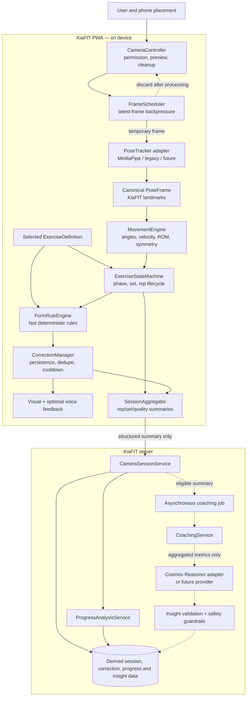
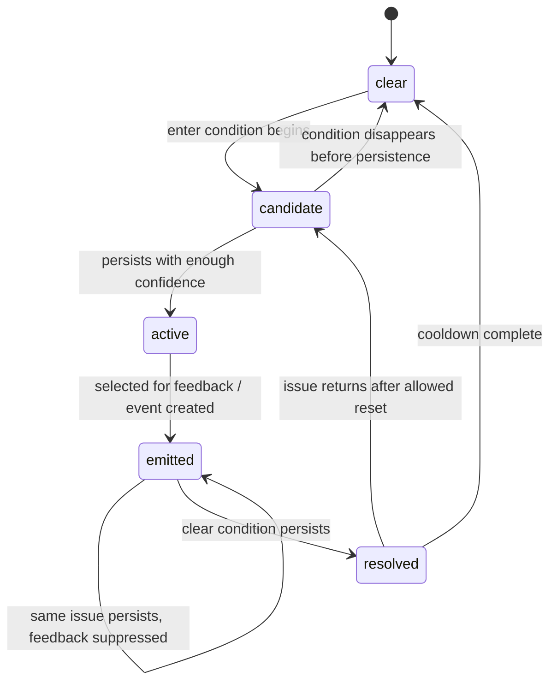
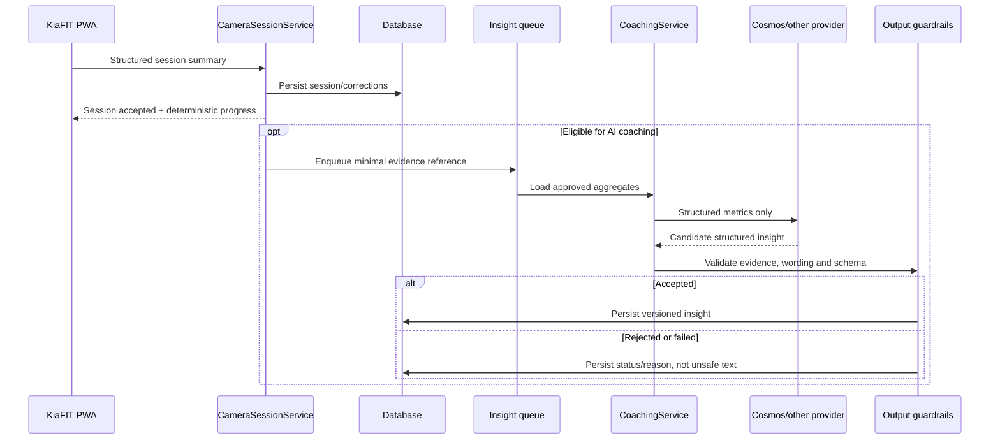

# KiaFIT Posture Tracking and AI Coaching Architecture

**Status:** Target subsystem architecture; no AI or posture feature is implied to be connected  
**Last updated:** 30 August 2026  
**Related documents:** [Product requirements](PRODUCT_REQUIREMENTS.md) · [High-level design](HIGH_LEVEL_DESIGN.md) · [Low-level design](LOW_LEVEL_DESIGN.md)

## 1. Executive design decision

KiaFIT’s posture feature is a hybrid, privacy-first computer-vision system. It is not a camera connected directly to a large language or vision-language model.

The required order of responsibility is:

```text
SEE       Pose tracker locates the body and joints.
MEASURE   Movement engine calculates how the body is moving.
UNDERSTAND Exercise state machine identifies the movement phase and repetition.
CHECK     Exercise-specific form rules identify supported technique issues.
CORRECT   Feedback manager gives one short immediate correction.
REASON    Optional AI coaching identifies higher-level patterns asynchronously.
REMEMBER  KiaFIT stores structured session and correction summaries.
IMPROVE   Progress analysis compares compatible sessions over time.
```

Real-time pose tracking, movement measurement, repetition counting and basic corrections must continue without an AI coaching provider. AI coaching is an optional intelligence layer above deterministic tracking.

## 2. Current repository assessment

### 2.1 Reusable foundations

| Existing asset | Reuse |
| --- | --- |
| React/Vite PWA | Own camera permission, preview, session UI and browser-side processing. |
| `apps/web/src/features/coach/model.ts` | Evolve into one provider adapter behind a KiaFIT-owned pose interface. |
| Teachable Machine model files | Retain for compatibility experiments; do not treat class predictions as rep/form validation. |
| `packages/pose-rules` | Extend its pure geometry and rep-state boundary into movement, exercise and correction modules. |
| `calculateAngle` | Keep as a generic geometry primitive after adding visibility/coordinate validation and tests. |
| `hasMinimumConfidence` | Generalise to required-landmark and exercise/viewpoint readiness checks. |
| Shared Zod contracts | Extend with strict derived-session and coaching-insight contracts. |
| Express API | Persist summaries, run progress analysis and mediate optional AI coaching. |
| Roadmap and progress design | Link each camera session to a task and return verified outcomes to Home. |

The current Teachable Machine metadata contains four labels: push-up, sit-ups, planking and squats. It does not include pull-ups. Its classifier may help with experimentation, but the reliable MVP flow uses explicit exercise selection.

### 2.2 Missing components

- Camera stream controller and lifecycle cleanup.
- Dedicated pose-provider abstraction with canonical KiaFIT landmarks.
- MediaPipe adapter or another validated real-time landmark provider.
- Frame scheduling, backpressure and adaptive processing.
- Movement metrics beyond one angle utility.
- Exercise definitions and configuration versioning.
- Exercise-specific state machines and rep records.
- Form-rule engine, correction lifecycle and feedback manager.
- Set/session aggregation and persistence API.
- Progress comparison over movement and correction metrics.
- `CoachingService`, AI provider adapter, job lifecycle and output guardrails.
- Privacy, performance and provider-failure tests.

### 2.3 Specification conflicts and resolutions

| Topic | Apparent conflict | KiaFIT resolution |
| --- | --- | --- |
| Camera ownership | A conceptual pose interface includes `startCamera`, while the specification says the application owns camera access. | `CameraController` owns `getUserMedia`, preview and tracks. `PoseTracker` only receives frames and never opens the camera. |
| Exercise detection | Existing model classifies four exercises; new prototype recommends squat, push-up and pull-up. | Manual selection is authoritative. Existing classification is optional experimental assistance. Pull-up is unsupported until its tracker/rules are validated. |
| Pose provider | Existing assets use Teachable Machine/Posenet; initial direction recommends MediaPipe. | Define one canonical interface first. Compare a legacy adapter and MediaPipe adapter through a measured spike; do not spread either provider’s types. |
| Correction rate | Earlier design counts unique corrected repetitions; the new brief also discusses correction events per valid rep. | Store and label both `correctedRepetitionRate` and `correctionEventsPerAnalysableRep`. Never call them the same metric. |
| Frame use by AI | Existing privacy rules prohibit frame upload; future experimentation mentions sampled frames/clips. | Baseline architecture sends no frames or clips to AI. Any future visual upload is a separate opt-in feature requiring privacy, consent, retention and provider review. |
| AI provider | NVIDIA Cosmos Reasoner is named, but no provider is connected. | `CoachingService` is provider-neutral. Cosmos is the desired candidate adapter, not a current capability or runtime dependency. |
| Safety wording | Product purpose mentions exercising more safely, but KiaFIT is not a medical system. | Phrase outcomes as movement-quality support. Never guarantee safety, diagnose injury or judge selected weight/machine settings. |

## 3. Target end-to-end architecture



Solid arrows are required for core posture tracking. Dashed AI arrows are optional and asynchronous.

## 4. Runtime lanes and latency isolation

The subsystem uses four lanes with different reliability and latency requirements.

| Lane | Work | Behavior |
| --- | --- | --- |
| Frame lane | Camera frame selection and pose estimation | Device-adaptive, high frequency, latest-frame wins. Never wait on cloud services. |
| Movement lane | Metrics, state transitions, rep counting and deterministic rules | Runs for each accepted pose result and remains fast/pure. |
| Feedback lane | Visual correction and optional speech | Immediate but throttled, prioritised and deduplicated. |
| Insight lane | Cross-rep/session progress and AI coaching | Lower frequency and asynchronous; may finish after the session. |

No cloud request, database request, speech utterance or analytics event may block the frame or movement lane.

## 5. Camera ownership

### 5.1 `CameraController`

The web application owns:

- Camera permission explanation and user-initiated request.
- `getUserMedia` constraints and selected facing mode.
- Live preview and optional skeleton overlay.
- Frame access for the tracker.
- Start, pause, resume, end and route-leave behavior.
- Device orientation and viewport changes.
- Stopping every `MediaStreamTrack` on all terminal paths.

The controller does not calculate exercise metrics or decide form.

### 5.2 Camera setup states

| State | Meaning/action |
| --- | --- |
| `introduction` | Explain supported behavior and no-video-storage policy. |
| `requesting_permission` | Browser permission prompt is active. |
| `permission_denied` | Explain how to retry or continue without Camera. |
| `positioning` | Show exercise/view-specific phone placement. |
| `body_not_visible` | No reliable required landmarks. |
| `partial_body` | Some required landmarks are missing. |
| `low_confidence` | Required landmarks are present but unreliable. |
| `ready` | Required landmarks and viewpoint checks pass for a stable window. |
| `exercise_active` | State machine and feedback are active. |
| `paused` | Preview may remain, but analysis and counting are suspended. |
| `summarising` | Stream has stopped; structured result is being finalised. |

Readiness requires stability over a configured time window. One good frame is insufficient.

### 5.3 Viewpoint configuration

Every exercise definition identifies allowed/recommended camera views and required landmarks. Initial recommendations from the brief are:

| Exercise | Candidate view | Validation status |
| --- | --- | --- |
| Squat | Side or slightly angled | Must be tested on representative devices/users. |
| Push-up | Side | Must be tested. |
| Pull-up | Front or angled | Must be tested; current classifier has no pull-up class. |

The UI must not promise equivalent accuracy from every camera angle.

## 6. Frame scheduling and processing

### 6.1 Backpressure

Pose inference must not build an unbounded frame queue.

1. Accept a frame only when no inference is already running.
2. If inference is busy, discard or replace the pending frame with the newest one.
3. Timestamp the frame using a monotonic clock.
4. Ignore late results after pause, exercise change, disposal or session end.
5. Adapt sampling frequency when processing time, temperature or battery pressure is high.

The architecture defines responsiveness and bounded work, not a fixed frames-per-second promise across all devices.

### 6.2 Temporary data flow

```text
Video frame reference
  → pose-provider inference
  → canonical PoseFrame
  → rolling movement window
  → state/rule result
  → frame reference released
  → obsolete landmarks removed from the rolling window
```

The rolling window retains only the minimum recent canonical/derived values needed for smoothing, velocity and current-rep logic. It is cleared at session disposal and is not persisted.

## 7. Pose-provider abstraction

### 7.1 Responsibility

`PoseTracker` answers only: “Where are the supported landmarks now, and how reliable are they?”

| Operation | Result |
| --- | --- |
| Initialise | Loads provider/model resources and exposes capability/version metadata. |
| Process frame | Returns one canonical pose result or a typed unavailable/no-pose result. |
| Get capabilities | Supported landmarks, 2D/3D support, confidence semantics and runtime backend. |
| Dispose | Releases provider/model memory and workers. |

It does not open the camera, select an exercise, count reps, produce coaching language or persist data.

### 7.2 Candidate adapters

| Adapter | Intended use |
| --- | --- |
| MediaPipe Pose/Pose Landmarker | Candidate initial real-time landmark tracker after a browser/device spike. |
| Existing Teachable Machine/Posenet adapter | Compatibility and baseline experimentation with current assets. |
| RTMPose/MMPose adapter | Future evaluation if accuracy, landmark coverage or deployment requirements justify it. |
| Development simulation | Deterministic UI/test fixture, visibly marked and unavailable in production. |

Provider selection must be based on measured accuracy, visibility handling, latency, bundle/runtime cost, device coverage and privacy/deployment requirements—not solely on model popularity.

### 7.3 Canonical `PoseFrame`

The rest of KiaFIT consumes a provider-neutral structure.

| Field | Meaning |
| --- | --- |
| `timestampMs` | Monotonic capture/inference timestamp. |
| `trackerId`, `trackerVersion` | Provider adapter and model version. |
| `coordinateSpace` | Normalised image coordinates and defined z/depth convention when available. |
| `overallConfidence` | Provider-normalised readiness signal; exact semantics documented per adapter. |
| `landmarks` | Map from KiaFIT landmark name to canonical landmark. |
| `inferenceDurationMs` | Performance diagnostic without visual content. |

Canonical landmark fields:

| Field | Rule |
| --- | --- |
| `x`, `y` | Normalised coordinates. |
| `z` | Optional provider-normalised depth; never assumed comparable across providers without mapping. |
| `visibility` | Probability/quality that the landmark is visible. |
| `presence` | Optional provider signal that the landmark exists. |

Required initial names include shoulders, elbows, wrists, hips, knees and ankles on both sides. Additional landmarks may be added without forcing exercise rules to use them.

### 7.4 Compatibility rule

Pose outputs from different providers or versions are not automatically comparable. Session summaries store tracker/model and correction-rule versions. Progress analysis uses an explicit compatibility matrix or separates the trend series.

## 8. Movement analysis engine

The movement engine answers: “How are the visible joints moving?” It contains generic math, not exercise-specific posture judgments.

### 8.1 Responsibilities

- Validate coordinate and timestamp ordering.
- Filter landmarks below configured visibility/presence thresholds.
- Smooth short-lived jitter without hiding real motion.
- Calculate joint angles and body-relative distances.
- Calculate torso orientation and joint alignment.
- Estimate velocity/direction using time-aware differences.
- Calculate range of motion across a rep/set window.
- Calculate left/right symmetry where both sides are reliable.
- Calculate stability/variance over a configured window.
- Report missing prerequisites rather than invent values.

### 8.2 Generic metrics

| Metric | Notes |
| --- | --- |
| Joint angle | Three-point angle with visibility and degenerate-vector checks. |
| Normalised distance | Distance scaled by a reliable body reference so camera distance has less influence. |
| Torso angle | Orientation from shoulder/hip midpoints relative to configured axis/view. |
| Alignment | Relative projected positions appropriate to the validated viewpoint. |
| Velocity | Time-normalised change; smoothed and bounded against timestamp gaps. |
| Movement direction | Descending, ascending, pulling, lowering, stable or unknown. |
| Range of motion | Observed extrema over one analysable rep/set, not a medical target. |
| Symmetry | Difference between comparable left/right measures only when both sides are visible. |
| Stability | Variance/oscillation of selected metrics over time. |

Exercise-specific terms such as “sufficient squat depth” belong in exercise rules, not geometry functions.

### 8.3 Missing data

Each metric result has one of:

- `available` with value and confidence.
- `insufficient_landmarks` with missing names.
- `low_confidence`.
- `unsupported_viewpoint`.
- `not_applicable`.

Rules may only evaluate an available metric that satisfies their confidence requirement.

## 9. Exercise selection and definitions

### 9.1 Manual selection first

For the MVP, the user selects the exercise or receives a preselected exercise from a roadmap task. This improves reliability and chooses the correct definition, viewpoint and feedback rules.

Automatic recognition is optional later:

```text
pose sequence → classifier suggestion → user confirmation → selected definition
```

The classifier may suggest; it does not silently switch exercise definitions during a session.

### 9.2 `ExerciseDefinition`

| Field | Purpose |
| --- | --- |
| `id`, `displayName`, `version` | Stable identity and configuration version. |
| `metricType` | Repetitions, timed hold or another supported outcome. |
| `allowedViewpoints`, `recommendedViewpoint` | Camera guidance and rule eligibility. |
| `requiredLandmarks` | Readiness set, optionally phase-specific. |
| `movementMetrics` | Generic metrics required by the state/rule engine. |
| `smoothingProfile` | Window and hysteresis configuration. |
| `states`, `transitions` | Exercise state machine. |
| `repCompletionPath` | Required valid state sequence. |
| `repValidityRules` | Completion, confidence and duration checks. |
| `postureRules` | Exercise- and phase-specific form definitions. |
| `feedbackMessages` | Reviewed short visual/voice wording. |
| `progressMetrics` | Metrics eligible for comparable history. |

Adding an exercise means adding and validating a definition and tests. It must not require modifying the camera controller, provider adapter or generic geometry engine.

## 10. Exercise state machines and rep lifecycle

The state machine answers: “Which phase of the selected exercise is occurring?” It consumes smoothed metrics and time, not raw UI events.

### 10.1 Candidate state paths

| Exercise | Candidate path |
| --- | --- |
| Squat | `standing → descending → bottom → ascending → standing` |
| Push-up | `top → descending → bottom → ascending → top` |
| Pull-up | `hanging → pulling → top → lowering → hanging` |

These paths are design candidates, not validated thresholds. Planking uses a timed-hold state machine rather than fake reps.

### 10.2 Transition requirements

- Thresholds are exercise-definition configuration.
- A transition requires confidence and persistence/hysteresis, not one sample.
- Invalid backward or skipped transitions do not complete a rep.
- Minimum/maximum plausible phase and rep durations are configurable.
- Duplicate final-state frames do not count duplicate reps.
- Visibility loss pauses or invalidates only according to defined rules.
- State exposes phase to posture rules.

### 10.3 `RepRecord`

| Field | Meaning |
| --- | --- |
| `repNumber` | Sequential within set/session. |
| `setNumber` | Current set. |
| `startedAtMs`, `endedAtMs`, `durationMs` | Relative session timing. |
| `completed` | Required sequence completed. |
| `analysable` | Sufficient coverage/confidence for form analysis. |
| `invalidReason` | Incomplete sequence, visibility, timing or confidence reason. |
| `phaseDurations` | Derived duration per phase. |
| `metricSummary` | Min/max/mean/trend for approved movement metrics. |
| `correctionEventIds` | Meaningful deduplicated events linked to this rep. |

Detailed per-frame measurements remain transient. The persisted rep summary contains only approved aggregates needed for progress/AI reasoning.

## 11. Form-rule engine

The form engine answers: “Is an analysable movement outside the configured expectations for this exercise and phase?” It is deterministic and fast.

### 11.1 Rule definition

| Field | Purpose |
| --- | --- |
| `id`, `version`, `exerciseId` | Stable rule identity. |
| `applicablePhases` | State-machine phases in which evaluation is valid. |
| `requiredMetrics`, `requiredLandmarks` | Prevent evaluation with missing evidence. |
| `minimumConfidence` | Rule-specific quality gate. |
| `enterCondition` | Threshold/expression that creates a candidate issue. |
| `clearCondition` | Hysteresis threshold that resolves it. |
| `minimumPersistenceMs` or sample count | Reject one-frame noise. |
| `severity` | Coaching priority, not medical severity. |
| `priority` | Selection order among simultaneous candidates. |
| `cooldownMs` | Repeat-feedback limit. |
| `messageKey` | Reviewed visual/voice wording. |
| `progressMetricKeys` | Derived evidence allowed in summary/trends. |

### 11.2 Initial rule categories

Candidate rules from the brief require validation before release:

- Squat: torso lean, depth, left/right imbalance, stability and knee alignment.
- Push-up: hip position, elbow range, shoulder symmetry and incomplete rep.
- Pull-up: swing, arm extension, height, shoulder symmetry and stability.

Machine rules are future exercise definitions. They may assess visible range, alignment, stability and controlled return. They do not assess selected weight, machine configuration or medical safety.

### 11.3 Confidence behavior

If evidence is missing or weak, the engine produces positioning/readiness guidance rather than a strong form claim. For example:

- “Move slightly farther back so your full body is visible.”
- “Try moving to a brighter area.”
- “I can’t reliably see your knees yet.”

No absence of a correction may be interpreted as good form when coverage is insufficient.

## 12. Correction lifecycle and aggregation

### 12.1 Lifecycle



One continuous issue creates one meaningful correction event, not one event per frame. A later recurrence may create another event only after resolution/reset rules are satisfied.

### 12.2 `CorrectionEvent`

| Field | Meaning |
| --- | --- |
| `id`, `ruleId`, `ruleVersion` | Traceable event/rule. |
| `exerciseId`, `setNumber`, `repNumber` | Context; rep may be absent for timed holds. |
| `type`, `severity` | Coaching category and non-medical priority. |
| `startedAtMs`, `resolvedAtMs` | Relative timing. |
| `messageKey`, `messageSnapshot` | Wording delivered. |
| `confidence` | Evidence quality. |
| `metricEvidenceSummary` | Approved aggregates, not raw frames/pose timeline. |
| `resolvedDuringRepOrSet` | Improvement signal. |

### 12.3 Feedback manager

The feedback manager selects one message at a time using:

1. Visibility/readiness problems that make other analysis unreliable.
2. Starting-position problems that prevent valid state tracking.
3. Highest-priority active exercise-specific rule.
4. Severity, confidence, duration and whether the message was recently spoken.

It enforces:

- Minimum persistence before feedback.
- One visual primary correction.
- One voice utterance at a time.
- Cooldown and duplicate suppression.
- A check for whether the issue resolved before repeating.
- User mute, reduced-distraction and accessibility settings.

Immediate messages are short and exercise-specific. AI-generated prose is never inserted into the high-frequency feedback loop.

## 13. Session aggregation and metrics

### 13.1 Count vocabulary

To avoid ambiguous progress claims, KiaFIT distinguishes:

| Metric | Definition |
| --- | --- |
| `detectedRepetitions` | Completed state-machine cycles detected. |
| `analysableRepetitions` | Detected reps with sufficient visibility/confidence/configuration for form evaluation. |
| `correctRepetitions` | Analysable reps with no recorded correction event under the active rule version. |
| `uniqueCorrectedRepetitions` | Analysable reps with one or more correction events. |
| `unclassifiedRepetitions` | Detected reps that cannot be labelled correct/corrected reliably. |
| `correctionEventCount` | Meaningful correction occurrences after persistence and deduplication. Multiple categories or recurrences may occur in one rep. |

Required invariants:

```text
analysableRepetitions ≤ detectedRepetitions
correctRepetitions + uniqueCorrectedRepetitions ≤ analysableRepetitions
unique corrected rep numbers are deduplicated across correction categories
```

### 13.2 Progress metrics

| Metric | Formula/use |
| --- | --- |
| Analysis coverage | `analysableRepetitions ÷ detectedRepetitions` |
| Corrected repetition rate | `uniqueCorrectedRepetitions ÷ analysableRepetitions` |
| Form consistency rate | `correctRepetitions ÷ analysableRepetitions` |
| Correction events per analysable rep | `correctionEventCount ÷ analysableRepetitions` |
| Category corrected-rep rate | Unique reps affected by category ÷ analysable reps |
| Rep consistency | Transparent variability of approved duration/range metrics |

When every detected rep is analysable, the corrected-repetition formula matches the earlier “unique corrected reps ÷ detected reps” definition. When coverage is incomplete, KiaFIT displays coverage and does not allow unanalysable reps to create a false improvement.

`Corrected repetition rate` and `correction events per analysable rep` answer different questions and must have different labels. A single arbitrary “perfect form score” is not part of the MVP.

### 13.3 Session summary

A persisted summary may include:

- Session, user, roadmap and task identifiers.
- Exercise definition, viewpoint, equipment and configuration versions.
- Start/end time, duration and set count.
- Detected, analysable, correct, corrected and unclassified rep counts.
- Per-set and approved per-rep aggregates.
- Deduplicated correction events and per-category summaries.
- Range-of-motion, symmetry, stability and tempo summaries when validated.
- Tracker/model, movement-engine and rule versions.
- Confidence/coverage quality and insufficiency reasons.
- Structured AI insight references when generated.

It never includes raw video, images, full frame sequences or full raw landmark timelines.

## 14. Progress analysis

Deterministic progress analysis is authoritative. AI may explain it but does not replace its comparability rules.

### 14.1 Comparison gate

Sessions are compared only when compatible in:

- Exercise definition.
- Equipment/machine type when relevant.
- Viewpoint and movement configuration.
- Tracker/model family or approved compatibility mapping.
- Movement/rule version.
- Minimum analysis coverage and confidence.
- Metric type and sufficient sample size.
- Comparable set/rep/difficulty context where the metric requires it.

### 14.2 Trend outputs

- Corrected-repetition rate over time.
- Correction events per analysable rep.
- Per-category affected-rep rate.
- Form consistency and analysis coverage.
- Rep duration/range consistency.
- Range-of-motion summary trend where validated.
- Symmetry summary trend where validated.
- Repeated, improving, disappeared and newly appearing correction categories.

Fewer corrections may indicate progress only when the comparison gate passes. Otherwise the UI displays `Insufficient comparable data` and its reason.

## 15. AI coaching layer

### 15.1 Role

The AI coaching layer answers: “What higher-level, evidence-supported pattern may help the user understand this set/session/history?”

Candidate responsibilities:

- Identify deterioration or improvement across later repetitions.
- Summarise repeated corrections and resolved issues.
- Compare early and late set consistency.
- Describe left/right or range trends already measured deterministically.
- Explain a session summary in natural, encouraging language.
- Suggest one evidence-linked focus for the next planned session.

It does not:

- Detect landmarks continuously.
- Own the camera.
- Count authoritative reps.
- Override deterministic correction events.
- Run for every frame.
- diagnose injury, fatigue or medical causes.
- Decide roadmap completion, points or reward eligibility.
- Claim a movement is safe.

### 15.2 `CoachingService`

KiaFIT code depends on `CoachingService`, not directly on Cosmos APIs.

| Operation | Purpose |
| --- | --- |
| Generate set insight | Optional summary of patterns across one completed set. |
| Generate session insight | Evidence-linked coaching after session persistence. |
| Generate progress insight | Natural-language explanation of deterministic comparable trends. |
| Get job/status | Pending, completed, unavailable, rejected or failed. |

Possible adapters include `CosmosReasonerCoachingProvider`, a future alternative provider and a deterministic development fixture. The fixture is always labelled simulated.

### 15.3 Trigger policy

For MVP experimentation, AI runs after a set/session, not during the frame loop.

An insight job is eligible only when:

- User/product configuration enables AI coaching.
- The session has sufficient analysis coverage.
- There is enough structured evidence for the requested insight.
- The same summary/rule/provider version has not already produced an accepted result.
- Privacy/provider configuration permits the request.

The UI never waits for AI before showing the deterministic session summary or completing the roadmap task.

### 15.4 AI input contract

Only minimum structured evidence is sent. Candidate fields:

- Opaque session and exercise IDs or approved display label.
- Exercise definition, viewpoint and equipment configuration.
- Set/rep numbers and approved per-rep metric summaries.
- Range, symmetry, stability, tempo and confidence aggregates.
- Deduplicated correction-event categories, timing and resolution.
- Analysis coverage and quality gates.
- Deterministic comparison results from compatible prior sessions.
- Reviewed coaching vocabulary, boundaries and requested output format.
- Tracker/model, rule and analysis versions.

Forbidden by default:

- Camera frames or screenshots.
- Video or audio recordings.
- Full raw pose/keypoint timeline.
- Student admin number, name or unnecessary profile data.
- Exact location, route or unrelated health data.
- Unbounded free-text content from other users/providers.

### 15.5 AI output contract

AI output is untrusted until validated. It should be schema-constrained to:

| Field | Purpose |
| --- | --- |
| `insightType` | Set, session or progress. |
| `summary` | Short, neutral overview. |
| `observations` | Bounded list tied to evidence keys. |
| `nextFocus` | At most one practical, supported focus. |
| `evidenceReferences` | Metric/correction IDs supporting each observation. |
| `limitations` | Low coverage, configuration or comparison caveats. |
| `provider`, `modelVersion`, `promptVersion` | Provenance. |
| `generatedAt` | Audit. |

Validation rejects or suppresses output that:

- Lacks evidence references.
- Contradicts deterministic counts/metrics.
- Makes medical, injury, diagnosis or safety guarantees.
- Invents an unsupported exercise issue.
- Mentions body appearance or compares users.
- Gives instructions outside the validated exercise vocabulary.
- Exceeds length or field limits.

### 15.6 Provider status and graceful degradation

| AI state | UX behavior |
| --- | --- |
| `not_requested` | Show deterministic summary only. |
| `pending` | Show “AI coaching insight is being prepared” without blocking completion. |
| `completed` | Show validated insight with AI/provider disclosure. |
| `insufficient_data` | Explain why no insight was requested. |
| `unavailable` | Tracking, reps, corrections and progress continue normally. |
| `rejected` | Do not display unsafe/unsupported provider output. |
| `failed` | Allow bounded retry when idempotent; deterministic data remains available. |

## 16. AI job and persistence flow



Recommended persisted `CoachingInsight` fields:

- ID, user ID and session/progress reference.
- Status and reason code.
- Insight type and validated structured output.
- Evidence-summary hash and input-contract version.
- Provider/model/prompt/guardrail versions.
- Generated/accepted timestamps.
- Stale/superseded status when underlying rules or sessions change.

Provider request/response retention must follow the provider agreement and KiaFIT privacy policy. Do not log full payloads by default.

## 17. API boundary

The camera summary remains the main client mutation. AI processing is server-mediated so provider credentials and guardrails remain off-device.

| Method and route | Purpose |
| --- | --- |
| `GET /api/v1/exercises` | Validated definitions, viewpoints, versions and support status. |
| `GET /api/v1/roadmap-tasks/:taskId/camera-context` | Authoritative exercise/task launch context. |
| `POST /api/v1/workout-sessions` | Strict structured session summary; rejects raw visual/pose fields. |
| `GET /api/v1/workout-sessions/:sessionId` | Deterministic summary and insight status. |
| `GET /api/v1/workout-sessions/:sessionId/coaching-insight` | Validated AI insight or typed availability state. |
| `POST /api/v1/workout-sessions/:sessionId/coaching-insight-requests` | Optional idempotent retry/request when product policy allows. |
| `GET /api/v1/progress/technique` | Deterministic compatible trends and optional validated narrative. |

The submission schema should be strict and fail on fields such as `frame`, `image`, `video`, `videoUrl`, `landmarks`, `poseFrames` or similar raw payloads.

## 18. Privacy and security rules

### 18.1 Baseline privacy guarantee

```text
Camera frame → local inference → temporary canonical landmarks
→ local movement/state/rules → derived session summary
→ discard frame and raw landmark history
```

- No automatic video recording.
- No automatic screenshots or frame upload.
- No raw landmark timeline persisted by default.
- No camera content in service-worker caches, analytics or logs.
- Camera permission requested only after explanation and user action.
- All media tracks and in-memory buffers cleaned on end, cancel, route leave and error.
- Structured AI input is minimised and server-mediated.

### 18.2 Future visual AI experiments

Occasional frames or clips are outside the baseline architecture. Introducing them requires a separate product decision covering explicit opt-in consent, purpose, provider processing, encryption, retention/deletion, withdrawal, age/student safeguards and a non-visual alternative. The current product privacy promise must not be weakened silently.

### 18.3 AI credentials and audit

- Provider credentials remain server-side.
- Requests use opaque IDs and minimal data.
- Access to session/insight records is user-authorised.
- Logs record job IDs, latency, token/compute accounting and outcome codes—not raw movement payloads unless a separately approved secure diagnostic mode exists.
- Model/prompt/guardrail versions are auditable.

## 19. Performance and resource behavior

- Only one pose inference should normally be active per camera session.
- Use latest-frame backpressure rather than a growing queue.
- Avoid React re-rendering for every landmark; use an imperative canvas/worker boundary where appropriate.
- Separate display refresh from inference rate.
- Keep rolling windows bounded by time/sample count.
- Dispose tensors, model resources, workers, speech and animation handles explicitly.
- Measure pose inference latency, movement/rule latency, dropped-frame count and thermal/battery warning signals without recording visual data.
- Reduce inference resolution/frequency gracefully on slower devices before abandoning the session.
- Keep deterministic feedback available when the network or AI provider is offline.

Performance budgets require device testing before exact numerical targets are committed.

## 20. Failure and degraded behavior

| Failure | Required result |
| --- | --- |
| Camera denied/unavailable | Explain retry and alternative activity; no fabricated session. |
| Pose model load fails | Stop analysis, release resources and identify model unavailable. |
| Body missing/partial | Pause reliable counting/corrections and show placement guidance. |
| Low confidence | Avoid strong correction; mark insufficient coverage where needed. |
| Unsupported viewpoint | Ask user to reposition; do not apply incompatible rules. |
| Frame processing too slow | Adapt frequency/resolution and show a neutral performance message if necessary. |
| State machine cannot complete | Do not count partial rep as completed. |
| Rule prerequisites missing | Skip that rule and record coverage, not good form. |
| Session API unavailable | Preserve only a safe structured pending summary if an explicit retry queue exists; never retain frames. |
| AI provider unavailable/slow | Show deterministic summary immediately; AI state is unavailable/pending. |
| AI output fails guardrails | Suppress candidate text; store typed rejection only. |

## 21. Exercise rollout

The architecture supports many exercises, but validation is deliberately incremental.

### Stage 0 — provider and camera spike

- Canonical `PoseFrame`.
- Camera lifecycle and privacy cleanup.
- Compare existing adapter and MediaPipe candidate on target browsers/devices.
- Skeleton overlay and readiness states.

### Stage 1 — one complete exercise

- Manual squat selection.
- Viewpoint validation.
- Generic movement metrics.
- Squat state machine and reliable rep counting.
- Three to five reviewed deterministic rules.
- Correction lifecycle, visual feedback and tests.

### Stage 2 — second movement pattern

- Push-up definition, side-view setup, state machine and rules.
- Demonstrate that no camera/provider rewrite is required.

### Stage 3 — pull-up

- Validate landmark visibility and phone placement.
- Add pull-up state/rules independently of the current classifier.

### Stage 4 — persistence and progress

- Set/rep summaries, correction events and comparable deterministic trends.

### Stage 5 — optional voice

- One utterance at a time, cooldown, mute and accessibility controls.

### Stage 6 — AI coaching experiment

- Provider-neutral `CoachingService`.
- Structured aggregate-only input.
- Asynchronous session insight, evidence binding and output guardrails.
- Cosmos candidate evaluation without making core tracking dependent on it.

### Stage 7 — advanced tracking and machines

- Evaluate RTMPose/MMPose only against measured needs.
- Add machine definitions when required landmarks and rules can be validated.

## 22. Validation and test matrix

### 22.1 Camera and provider

- Camera is opened only by the application after user action.
- Switching exercise/view does not leak tracks, workers or pending inference.
- Leaving the route stops every track and clears buffers.
- Only one inference is active; slow inference does not grow a queue.
- Provider output maps consistently into canonical landmarks.
- Development simulation is visibly identified and cannot run as production silently.

### 22.2 Movement and state

- Generic geometry rejects missing, low-confidence and degenerate input.
- Smoothing reduces jitter without preventing valid phase transitions.
- Each exercise follows its required state sequence.
- One completed sequence creates one rep.
- Partial/skipped sequences do not count.
- Repeated final-state frames do not duplicate a rep.
- Plank uses timed-hold behavior.

### 22.3 Rules and feedback

- A one-frame threshold crossing creates no correction.
- A persistent issue creates one active correction/event.
- Continuing the same issue does not create frame-by-frame events.
- Resolution and later recurrence follow cooldown/reset rules.
- Missing prerequisites produce visibility guidance, not form certainty.
- One correction is displayed/spoken at a time.
- Voice respects mute and is cancelled on end/route leave.

### 22.4 Aggregation and progress

- One rep with multiple categories appears once in `uniqueCorrectedRepetitions`.
- Multiple meaningful events in one rep affect event rate without duplicating corrected-rep rate.
- Unanalysable reps reduce coverage and do not falsely improve form rate.
- Division by zero returns insufficient data.
- Incompatible provider/rule/view/exercise sessions are not compared.
- Trend messages cite the correct evidence window.

### 22.5 Privacy

- Session API rejects frame, image, video and raw landmark fields.
- No raw camera/pose data reaches persistence, analytics, logs or service-worker cache.
- Cleanup occurs after normal completion, cancellation, error and navigation.
- AI input contains only approved aggregates and opaque identifiers.

### 22.6 AI coaching

- Core tracking works with AI disabled and unavailable.
- AI work never blocks the frame loop or session completion.
- Duplicate insight requests are idempotent.
- Output without evidence is rejected.
- Output contradicting deterministic metrics is rejected.
- Medical/safety guarantees and unsupported claims are rejected.
- Provider/model/prompt/guardrail versions are stored.

## 23. Observability

Privacy-safe measurements include:

- Camera permission and readiness outcomes.
- Provider/model load status and version.
- Inference/movement/rule timing histograms.
- Dropped/skipped frame counts.
- State transition and rep completion counts using opaque session IDs.
- Correction event type/count and suppression count.
- Analysis coverage and comparability exclusion reason.
- AI job latency, provider status, acceptance/rejection reason and cost accounting.

Never emit frames, images, video, full landmarks, exact camera environment or user-identifying content in ordinary telemetry.

## 24. Decisions required before implementation

- Whether MediaPipe or the existing tracker adapter is the first production candidate after measurement.
- Canonical landmark set and coordinate/depth conventions.
- Initial supported device/browser matrix.
- Which single exercise is validated first and who approves its rules/messages.
- Exact viewpoint, readiness, confidence, smoothing and transition thresholds.
- Whether pull-up remains in the three-exercise prototype despite current model mismatch.
- Minimum analysis coverage and comparable-session evidence window.
- AI coaching opt-in and disclosure behavior.
- Cosmos deployment/API availability, data handling, region, retention, cost and model-version policy.
- Asynchronous job infrastructure and retry limits.
- Data retention/deletion periods for rep aggregates, corrections and insights.

Until these decisions are resolved, implementations remain development-only and must not claim validated posture coaching.

## 25. Non-negotiable architecture rules

- Do not send every camera frame to an AI reasoner.
- Do not rely on AI for authoritative rep counting.
- Do not store video, frames or full raw pose timelines by default.
- Do not trigger warnings or correction events from one noisy frame.
- Do not hard-code exercise rules inside UI components.
- Do not expose provider-specific pose types beyond the adapter.
- Do not couple the UI directly to NVIDIA Cosmos or another AI provider.
- Do not wait for cloud reasoning inside the real-time loop.
- Do not claim support for an exercise before its viewpoint, state machine and rules are validated.
- Do not create an arbitrary opaque form score.
- Do not treat fewer raw corrections as progress without coverage, denominator and comparability checks.
- Do not let posture tracking operate as an unrelated tool; return its verified outcomes to Roadmap, Progress and eligible Rewards logic.
